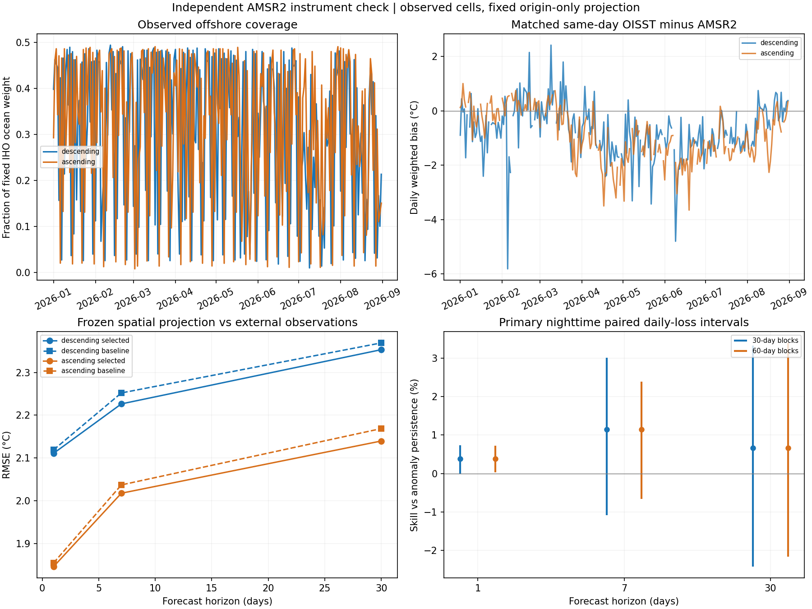

# AMSR2 独立仪器观测验证：完成与复现

## 实际完成范围

使用 RSS/JAXA GCOM-W1 AMSR2 v8.2 官方原始每日三级微波观测，2026 年 1—8 月。
三个步长的30天块技能区间均跨零，独立观测未确认稳定预测优势。完成的是独立仪器来源的离岸格点验证。AMSR2 漂移校准存在 Reynolds SST 共同参考，不能声称完全统计独立；缺测岸区与全海域均值未获得直接外部真值。

主分析为下降轨夜间观测；上升轨、直接格点持续性与 30/60 天块长全部保留。
不能把卫星缺测部分填成 OISST，也不能把格点数量当成独立实验次数。

## 事前记录

- 冻结提交：[a3deb64](https://github.com/Joao-Ray/yellow-sea-sst-stochastic-modeling/commit/a3deb64aba90017d59b47ac1c9404f0efbe41ad7)。
- 冻结 UTC：2026-10-04T13:24:07.098786+00:00。
- 冻结 SHA-256：`ecc8c46b5f2653dc2e4f3e636c9206a2460bbe2c5dd15123f82ad51cdaba2f03`。
- 四份输入字节校验锁定：原模型冻结文件、原 2026 区域预测、历史区域 SST、固定网格掩膜。
- 首次外部目标获取 UTC：2026-10-04T13:34:04.636569+00:00。
- 原 OISST 2026 成绩已被查看；不能把整个研究重新称为从未查看的确认性试验。

## 匹配和统计

格点预测 = 起点 d−h 的格点 OISST + 冻结区域目标预测 − 起点区域 OISST。
空间偏差保持起点值，不估计新系数。异常持续性采用相同投影，直接格点持续性另列。
目标日 OISST 只用于产品差异诊断，不进入预测。

严格使用原固定 IHO 海洋格点、完全相同坐标、官方 SST 范围 [-3,35]℃、
UTC 像元时间 [0,24) 小时，以及 land/coast/sea_ice/noobs 四个零质量标记。
每日至少 20 个共同有效格点，每轨道/步长至少 120 个评分日；不插值。
每日共同格点内纬度余弦加权误差，随后日期等权。成对循环日历块抽样 1000 次，
30/60 天两种块长，种子 20261004，保留缺测日历间隔。不进行三步长/两轨多重比较校正。

## 实际结果

| 步长 | 冻结方法 | 有效日 | 格点日配对数 | RMSE（℃） | 基线RMSE（℃） | 技能 | 30天块95%区间 | 60天块95%区间 |
|---:|---|---:|---:|---:|---:|---:|---|---|
| 1 | 季节谐波+趋势+岭回归 | 225 | 46393 | 2.1108 | 2.1189 | 0.4% | [-0.02%, 0.74%] | [0.03%, 0.72%] |
| 7 | 季节谐波+趋势+AR | 225 | 46393 | 2.2264 | 2.2521 | 1.1% | [-1.09%, 3.01%] | [-0.66%, 2.39%] |
| 30 | 季节谐波+趋势+AR | 225 | 46393 | 2.3533 | 2.3691 | 0.7% | [-2.42%, 3.32%] | [-2.17%, 3.39%] |

1 天技能 0.4%，至少一种块长区间跨零或块长间方向不同，优势不明确。 7 天技能 1.1%，至少一种块长区间跨零或块长间方向不同，优势不明确。 30 天技能 0.7%，至少一种块长区间跨零或块长间方向不同，优势不明确。



## 日夜与产品对照

| 观测轨道 | 有效日 | 同格点OISST与AMSR2 RMS差（℃） | OISST−AMSR2偏差（℃） |
|---|---:|---:|---:|
| ascending | 215 | 1.8136 | -0.8747 |
| descending | 225 | 2.0893 | -0.7225 |

ascending 同日产品RMS差 1.814℃、OISST−AMSR2偏差 -0.875℃。 descending 同日产品RMS差 2.089℃、OISST−AMSR2偏差 -0.723℃。这些较大的产品差异限制模型技能的可辨识性；不能把全部差异当成预测模型误差，也未按结果删去异常日期或进行偏差校正。


### 日夜敏感性与直接格点持续性

| 轨道 | 步长 | 选定方法RMSE（℃） | 直接格点持续性RMSE（℃） | 选定方法相对异常持续性技能 |
|---|---:|---:|---:|---:|
| descending | 1 | 2.1108 | 2.1635 | 0.4% |
| descending | 7 | 2.2264 | 2.6272 | 1.1% |
| descending | 30 | 2.3533 | 4.7577 | 0.7% |
| ascending | 1 | 1.8457 | 1.9237 | 0.5% |
| ascending | 7 | 2.0174 | 2.5711 | 1.0% |
| ascending | 30 | 2.1396 | 4.9499 | 1.3% |

### 观测覆盖范围

| 轨道 | 至少20格点的日期数 | 每日有效格点中位数 | 有效权重比例最小/中位/最大 |
|---|---:|---:|---|
| ascending | 215 | 230 | 0.8% / 35.4% / 49.1% |
| descending | 225 | 220 | 1.0% / 34.4% / 49.4% |

上升轨、直接格点持续性以及全部预先规定块长均在 metrics.csv 和 block_sensitivity.csv 中保留。产品差异表的目标日 OISST 未进入预测。卫星误差和空间投影误差都包含在预测RMSE中，不能单独归因于随机模型。


## 复现

仓库根目录、Python 3.11、requirements.txt：

```bash
python -m src.research
python -m src.validation evaluate
python -m src.independent
```

第三条命令直接读取公开冻结记录；历史输入 SHA 不一致则停止。不要重生成冻结文件
并声称仍是首次未查看观测。243 个官方文件保留源 URL、原属性、UTC 获取时间、
强 ETag、逐个字节区间 SHA 与裁剪 NPZ 的 SHA。使用 HTTP 范围读取，全球源文件
未全量下载，所以不声称完整全球文件 SHA 校验。最多三个文件并发获取。

本地原始裁剪与完整属性记录位于 data/raw/independent/；data/processed/independent/
包含逐日误差、观测覆盖、产品差异、冻结文件、来源记录、全部图、整篇论文和单文件 HTML。
公开 paper/independent/ 包含汇总结果、覆盖和来源，不发布原始卫星 SST。
较早研究、同源时间验证和它们的来源记录继续单独保留。

## 事后读取诊断复现

为复核较大的产品差异，另对 2026-02-05 完整官方文件进行第二读取方式检查，
六个变量与原范围读取完全一致，包括自动单位缩放、缺测值和轨道标记。
这个事后诊断没有调整评分规则或排除日期。记录与完整源文件 SHA 在 source_audit.json。

```bash
python -m src.data.download_amsr2 --audit-date 2026-02-05
python -m src.independent
```

第二行校验缓存、重新生成包含读取诊断的报告；评分保持相同。

## 原产品和致谢

- [RSS GCOM-W1 AMSR2 Daily Environmental Suite v8.2, DOI 10.56236/RSS-bq](https://www.remss.com/DOI/RSS-bq.html)。
- [RSS v8.2 技术报告](https://images.remss.com/papers/tech_reports/2021/AMSR-2_Air-Sea_Essential_Climate_Variables_RSS_Version_8.2.pdf)：Reynolds SST 共同参考依赖。
- [NOAA OISST 官方更新历史](https://www.ncei.noaa.gov/products/optimum-interpolation-sst)：2021 年引入 ACSPO AVHRR/VIIRS，2023 年调整船舶偏差。旧 AVHRR 目录名不是全时期传感器清单。

AMSR2 AS-ECV 由 RSS 生产、NASA 支持，辐射计观测由 JAXA 提供。
