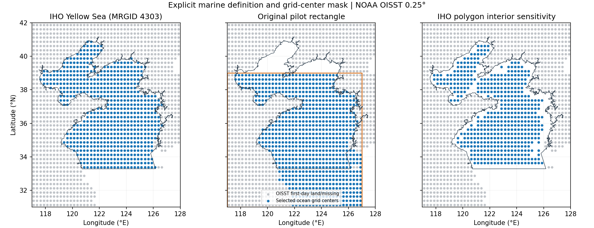
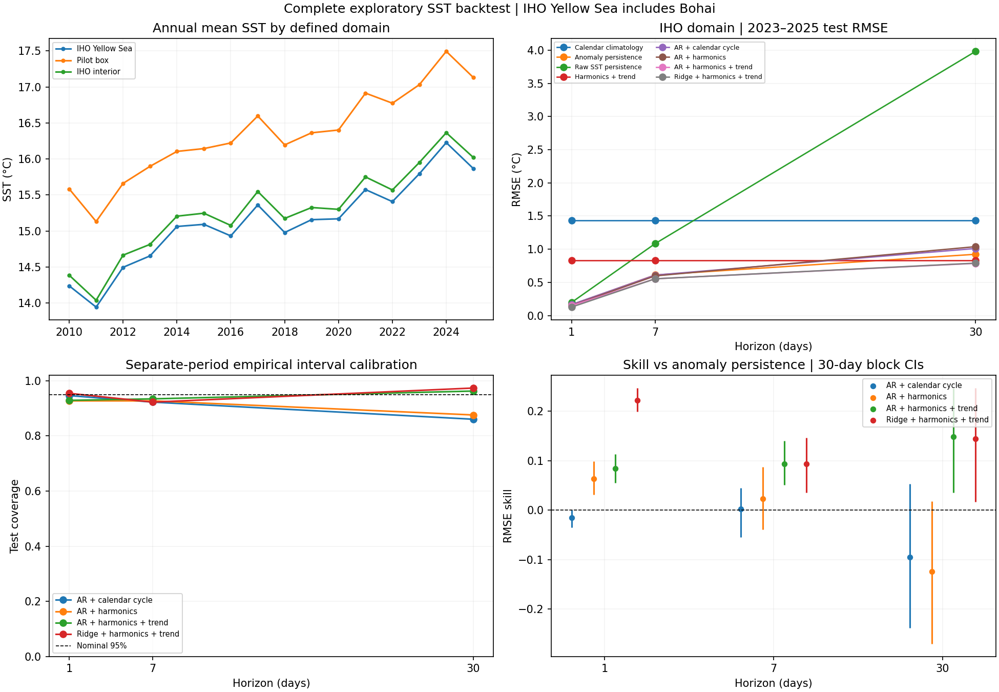
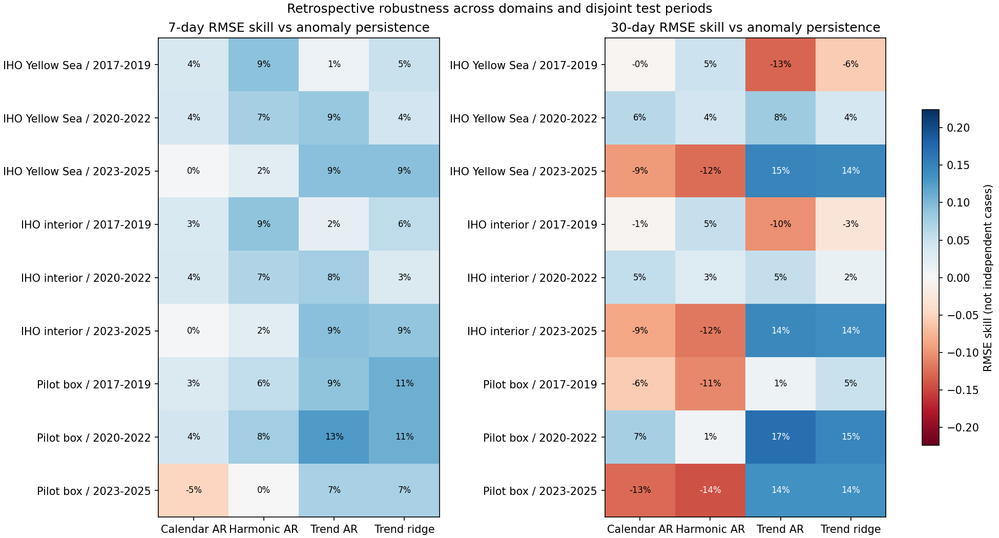
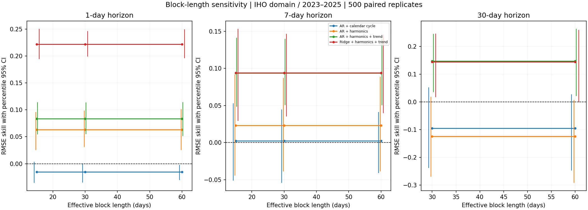
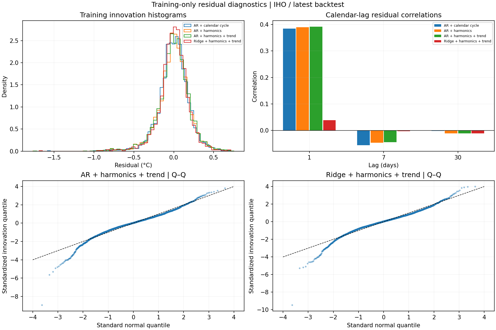

# 黄海区域海表温度的随机建模、正则化预测与时间回溯评估

**论文初稿 · 探索性回溯研究 · 2026-10-03**

## 摘要

本研究使用 NOAA OISST 2010–2025 年每日海表温度分析产品，对 Marine Regions IHO Yellow Sea 定义下的区域均值进行预测比较。主区域包含 651 个首日有效海洋格点，共 5844 个有效日。研究比较训练日历季节均值、异常及原始温度持续性、季节谐波、线性趋势、自回归与正则化自回归。模型参数、选择和区间校准使用先后分离的时间段；2017–2019、2020–2022、2023–2025 三段用于回溯测试。另考察区域与块长敏感性。
1 天时，异常持续性 RMSE 为 0.1643℃；该测试表中误差最小的扩展模型为 季节谐波+趋势+岭回归，RMSE 0.1279℃、技能 22.2%、30 天块区间 [19.9%, 24.6%]。这一“最小误差”是测试结果的事后描述，不是部署模型选择规则。 7 天时，异常持续性 RMSE 为 0.6121℃；该测试表中误差最小的扩展模型为 季节谐波+趋势+岭回归，RMSE 0.5546℃、技能 9.4%、30 天块区间 [3.5%, 14.7%]。这一“最小误差”是测试结果的事后描述，不是部署模型选择规则。 30 天时，异常持续性 RMSE 为 0.9240℃；该测试表中误差最小的扩展模型为 季节谐波+趋势+AR，RMSE 0.7873℃、技能 14.8%、30 天块区间 [3.5%, 24.5%]。这一“最小误差”是测试结果的事后描述，不是部署模型选择规则。
结果支持按明确海域和时期评估模型；精度、区间覆盖和结构稳定性须分别考察。本扩展是在初次试验成绩已被查看后设计，不能视为未触碰测试集的确认性证明。

**关键词：** 海表温度；黄海；OISST；自回归；岭回归；时间块抽样；区间校准

## 1. 引言

区域海表温度具有明显季节性与持续性。单靠较低短期预测误差，难以区分对季节周期的利用、对异常持续性的刻画及对长期变化的外推。随机过程模型还依赖创新误差与稳定性假设，因此应同时检查预测区间与时期变化。
本项目围绕三个问题展开：（1）不同季节/趋势处理能否在特定回溯时期减少持续性基线的误差；（2）正则化的滞后模型是否呈现一致的描述性技能；（3）单独历史校准期的经验区间在后续时期是否接近名义覆盖。研究不把 OU 的连续时间解释作为与 AR(1) 独立的额外模型。

## 2. 数据与研究海域

OISST 是 0.25° 的融合分析产品，结合卫星与现场资料；它不是每个格点独立实测。数据通过 NOAA PSL 官方服务按月获取，保留产品元数据、请求地址、下载时间和校验和。2016 年前的 PSL 旧版元数据依据 NCEI 对 v2.1 历史 SST 等价性的说明记录，2016 年以后要求 v2.1 标识。[1–3]
海域采用 Flanders Marine Institute IHO Sea Areas v3 中 MRGID 4303。**该多边形包含渤海**，本文结果适用于这一操作定义。每个格点以中心是否被多边形覆盖选择，再与 2010-01-01 有效海洋格点相交；区域 SST 使用纬度余弦权重。边界敏感性包括原试验矩形与向内收缩 0.125° 的多边形，后者为经纬度平面操作而非地理等距离岸线缓冲。[4]
主区域 5844 个日历日中有效 5844 天、缺测 0 天；最低有效权重比例 100.0%。未使用时间插值。图 1 显示区域、首日土地/缺测格点与选定海洋格点。

## 3. 方法

### 3.1 确定性季节项与趋势

训练期日历日均值按月日字符串计算，闰日不会导致三月以后错位。谐波方案为截距加三组年度正余弦；趋势方案再加入从训练首日起计算的线性年份项。所有系数只在训练期通过最小二乘估计。谐波相位使用共同闰年模板。线性趋势向测试期外推是一项建模假设，不能解释为未来升温的已知速度。
### 3.2 随机过程与正则化

移除确定性项后，用完整连续日历滞后向量拟合带截距 AR(p)：xₜ = c + Σ φⱼxₜ₋ⱼ + εₜ。候选 p = 1,3,7,14，仅用选择期 7 天 RMSE 选阶。岭回归固定 14 阶，训练期中心化和标准化滞后变量，最小化训练均方误差加 alpha 倍标准化系数平方和；截距不惩罚，alpha 从 0.001/0.01/0.1/1.0 中用同一选择规则决定。所有最终参数仍保留训练期拟合值。
满足 0<φ<1 的 AR(1) 有精确 OU 日采样解释：θ=−log(φ)、μ=c/(1−φ)、σ²=Var(ε)·2θ/(1−φ²)。两者日转移与预测相同，因此不增加独立比较项。
### 3.3 时间协议与基线

每次回溯依次划分训练、选择、区间校准、测试。第一回溯训练截止 2014 年，2015 年选择、2016 年校准、2017–2019 年测试；第二回溯截止 2017 年训练，2018 年选择、2019 年校准、2020–2022 年测试；第三回溯截止 2019 年训练，2020–2021 年选择、2022 年校准、2023–2025 年测试。测试时期互不重叠，训练期资料重叠。
目标 d、步长 h 的观测起点为 d−h；递归预测只用该起点及更早的滞后向量，不读取中间未来观测。所有预测加回固定确定性项后在摄氏温度尺度评分，保证模型目标一致。主要基线是原日历季节异常的持续性，另报告原始温度持续性和季节/趋势基线。每步长所有模型使用共同有效日期。
### 3.4 指标、技能与不确定性

报告 MAE、RMSE、预测偏差、95% 区间覆盖和全宽。技能为 1−RMSE模型/RMSE异常持续性。成对循环日历块抽样在模型与基线平方误差上使用相同索引，保留日历缺口；500 次、种子 42，块长取 max(h,15/30/60)。95% 百分位技能区间依赖近似平稳性，未作多重比较校正。
AR 原始高斯条件区间使用训练创新方差与冲击响应平方和，忽略参数和季节项估计误差。经验区间的半径取单独校准期 ceil((n+1)×0.95) 阶绝对误差；串行相关及分布漂移下不保证覆盖。岭回归仅报告经验区间。逐年评分检验总体均值掩盖的变化。

## 4. 结果

### 4.1 最近测试期主区域

1 天时，异常持续性 RMSE 为 0.1643℃；该测试表中误差最小的扩展模型为 季节谐波+趋势+岭回归，RMSE 0.1279℃、技能 22.2%、30 天块区间 [19.9%, 24.6%]。这一“最小误差”是测试结果的事后描述，不是部署模型选择规则。
7 天时，异常持续性 RMSE 为 0.6121℃；该测试表中误差最小的扩展模型为 季节谐波+趋势+岭回归，RMSE 0.5546℃、技能 9.4%、30 天块区间 [3.5%, 14.7%]。这一“最小误差”是测试结果的事后描述，不是部署模型选择规则。
30 天时，异常持续性 RMSE 为 0.9240℃；该测试表中误差最小的扩展模型为 季节谐波+趋势+AR，RMSE 0.7873℃、技能 14.8%、30 天块区间 [3.5%, 24.5%]。这一“最小误差”是测试结果的事后描述，不是部署模型选择规则。

| 步长 | 模型 | RMSE（℃） | 技能 | 95% 技能区间 | 经验覆盖 | 全宽（℃） |
|---:|---|---:|---:|---|---:|---:|
| 1 | 异常持续性基线 | 0.1643 | 0.0% | [0.0%, 0.0%] | 95.2% | 0.651 |
| 1 | 原始温度持续性 | 0.1985 | -20.8% | [-28.2%, -14.1%] | 93.8% | 0.748 |
| 1 | 日历季节均值+AR | 0.1669 | -1.5% | [-3.5%, 0.0%] | 94.6% | 0.658 |
| 1 | 季节谐波+AR | 0.1540 | 6.3% | [3.1%, 9.9%] | 92.7% | 0.554 |
| 1 | 季节谐波+趋势+AR | 0.1506 | 8.4% | [5.5%, 11.3%] | 92.9% | 0.572 |
| 1 | 季节谐波+趋势+岭回归 | 0.1279 | 22.2% | [19.9%, 24.6%] | 95.4% | 0.529 |
| 7 | 异常持续性基线 | 0.6121 | 0.0% | [0.0%, 0.0%] | 92.3% | 2.089 |
| 7 | 原始温度持续性 | 1.0845 | -77.2% | [-98.6%, -60.3%] | 91.8% | 3.551 |
| 7 | 日历季节均值+AR | 0.6108 | 0.2% | [-5.4%, 4.5%] | 92.2% | 2.126 |
| 7 | 季节谐波+AR | 0.5979 | 2.3% | [-3.9%, 8.7%] | 92.7% | 2.098 |
| 7 | 季节谐波+趋势+AR | 0.5548 | 9.4% | [5.1%, 14.0%] | 93.4% | 2.039 |
| 7 | 季节谐波+趋势+岭回归 | 0.5546 | 9.4% | [3.5%, 14.7%] | 92.2% | 1.944 |
| 30 | 异常持续性基线 | 0.9240 | 0.0% | [0.0%, 0.0%] | 94.6% | 3.646 |
| 30 | 原始温度持续性 | 3.9813 | -330.9% | [-416.5%, -266.0%] | 86.2% | 10.976 |
| 30 | 日历季节均值+AR | 1.0115 | -9.5% | [-23.8%, 5.3%] | 86.0% | 2.911 |
| 30 | 季节谐波+AR | 1.0391 | -12.5% | [-27.0%, 1.8%] | 87.6% | 3.070 |
| 30 | 季节谐波+趋势+AR | 0.7873 | 14.8% | [3.5%, 24.5%] | 96.3% | 3.363 |
| 30 | 季节谐波+趋势+岭回归 | 0.7905 | 14.4% | [1.7%, 24.7%] | 97.4% | 3.464 |

### 4.2 区域、时期和块长

图 3 保留全部区域与三个测试时期的 7/30 天技能点估计。区域互相重叠，因此不能把各格视作独立实验。图 4 显示最近主区域技能区间对块长的变化；点估计不因块长改变，但依赖误差抽样的区间会改变。详细结果与逐年偏差在配套 CSV 中保留。

### 4.3 残差与区间校准

主区域最近回溯的训练创新中，趋势谐波 AR 一日相关为 0.392，岭回归为 0.039。超额峰度分别为 4.18 与 4.71。岭回归的短期残差相关较弱，但尾部偏离仍明显；降低相关不等于证明高斯创新假设。

## 5. 讨论

持续性是必要的强基线，模型复杂度本身不保证较好预测。季节平滑可能减少短记录日历均值的噪声；线性趋势改变长期均值的外推方式；岭回归约束相关滞后的系数。这些机制是模型设定的解释，不能仅凭本回溯建立因果关系。
较低 RMSE 与较好区间覆盖是不同目标。校准样本来自过去，不能消除后续时期的分布变化；扩大区间也会影响实用性，故必须同时报告宽度。区域均值可掩盖沿岸和海盆内的差异，IHO 定义又包含渤海；改用狭义黄海需要新的明确海域来源并重新计算。
本扩展在初次矩形试验测试成绩已被查看后形成。虽然本次计算严格隔离时间段，并在运行前固定新配置，但所有扩展结果仍为探索性回溯证据。测试表中事后最佳模型不应直接成为部署模型；未来确认需要真正未查看的时期或外部资料。

## 6. 结论

本项目交付完整、可追溯的海域 SST 预测研究流程与真实数据结果，涵盖随机过程、正则化、校准与稳健性。数值结论仅适用于所定义海域、数据产品、时段和候选模型。研究不承诺复杂模型优于持续性，不把技能区间误解为温度预测区间，也不把探索性回溯视为最终确认。

## 数据与代码可用性

代码仓库：https://github.com/Joao-Ray/yellow-sea-sst-stochastic-modeling。运行 `python -m src.research` 生成全部结果与本文初稿。raw/derived 数据不纳入 Git；官方下载 URL、SHA-256、版本、环境与配置在 protocol.json 中记录。边界从 Marine Regions 获取，不镜像重新分发。

## 参考资料

1. NOAA/NCEI. OISST Version 2.1. DOI: [10.25921/RE9P-PT57](https://doi.org/10.25921/RE9P-PT57)；[官方产品说明](https://www.ncei.noaa.gov/products/optimum-interpolation-sst)。
2. Huang et al. (2021). Improvements of the Daily Optimum Interpolation Sea Surface Temperature (DOISST) Version 2.1. [10.1175/JCLI-D-20-0166.1](https://doi.org/10.1175/JCLI-D-20-0166.1)。
3. NOAA PSL. [OISST 数据与服务](https://psl.noaa.gov/data/gridded/data.noaa.oisst.v2.highres.html)。
4. Flanders Marine Institute (2018). IHO Sea Areas, version 3. [10.14284/323](https://doi.org/10.14284/323)；[Yellow Sea MRGID 4303](https://www.marineregions.org/gazetteer.php?id=4303&p=details)。
