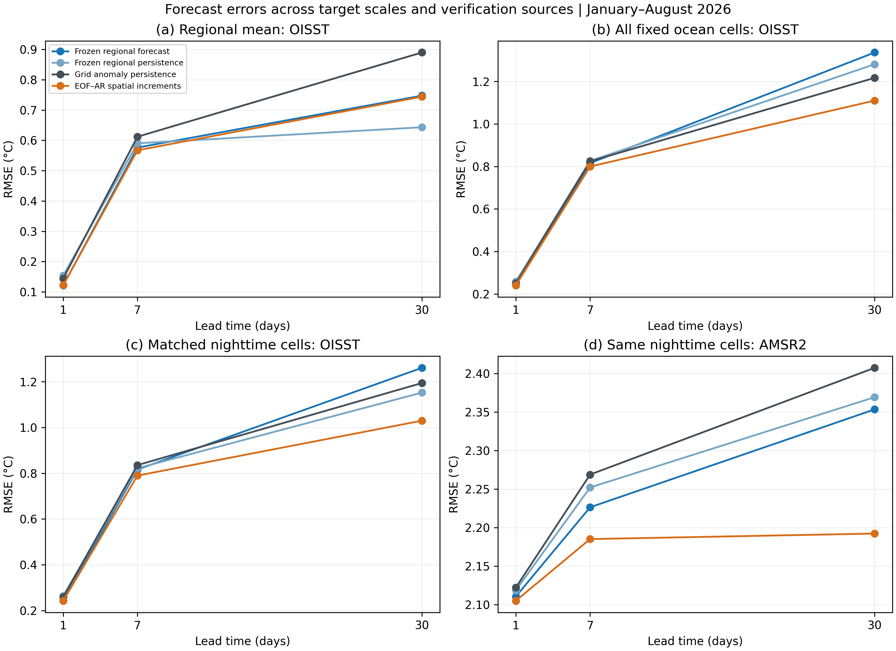
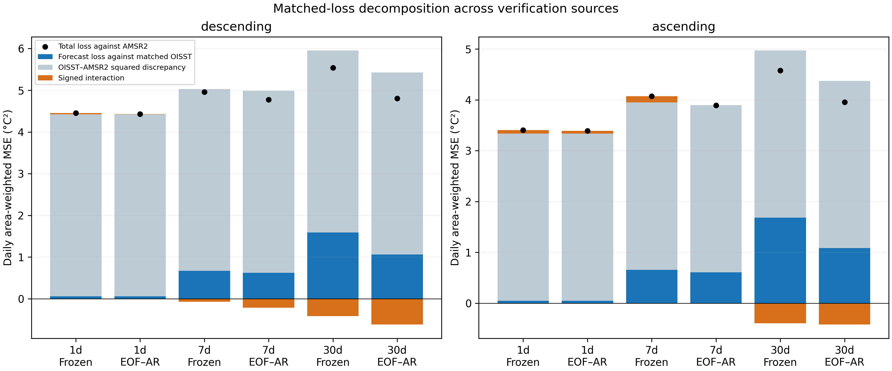
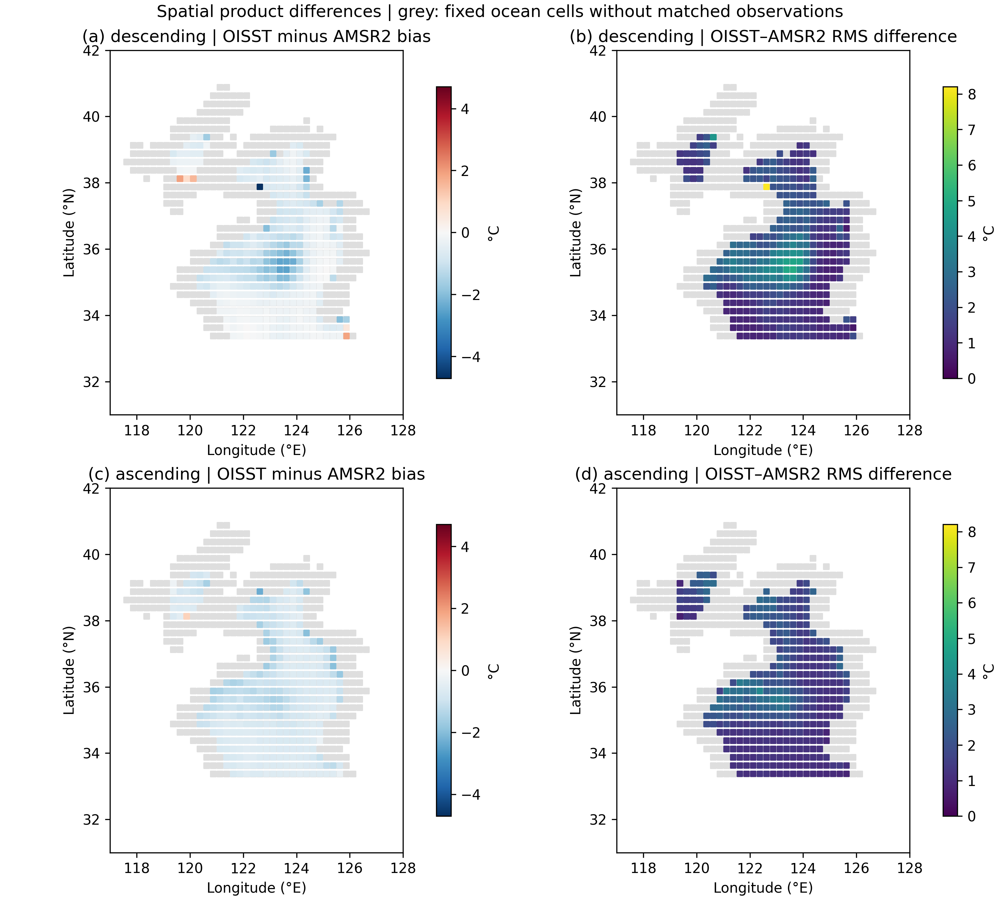
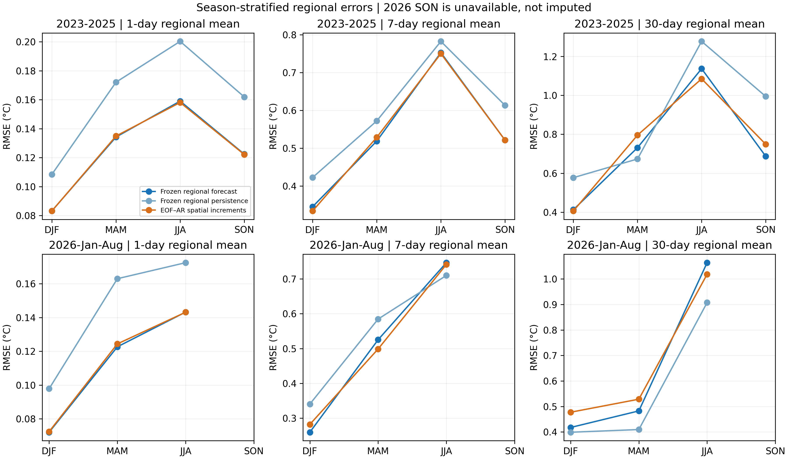

# Spatial aggregation and observation-source dependence of short-range sea surface temperature forecast skill in the Yellow–Bohai Sea

## Abstract

Forecast skill estimated from a regional sea surface temperature (SST) analysis need not transfer to local temperatures measured by another instrument. We examine this transfer in the Yellow–Bohai Sea using daily NOAA OISST from 2010 to August 2026 and independent-instrument AMSR2 microwave retrievals during January–August 2026. Seasonal autoregressive and regularized models were estimated, selected and calibrated in separate historical periods, then frozen before acquiring the 2026 OISST targets. Against regional OISST, the selected forecasts reduced one-day root-mean-square error (RMSE) by 21.1% relative to anomaly persistence, whereas seven-day and thirty-day skill was 2.4% and −16.2%. Matched nighttime AMSR2 verification yielded corresponding improvements of only 0.38%, 1.14% and 0.67%; all original thirty-day-block confidence intervals included zero. Exact matched-loss identities show that changing verification source can reverse thirty-day squared-loss advantage on identical dates and cells. A retrospective empirical orthogonal function–autoregressive control reduces thirty-day external RMSE by 8.9% against grid-specific anomaly persistence, requiring later independent confirmation. The diagnostics distinguish spatial aggregation, incomplete sampling and verification-source effects without assigning either product the status of error-free truth. The results support a narrowly defined gain in one-day regional analysis prediction and show why that gain cannot establish basin-wide, instrument-independent SST predictability.

**Keywords:** sea surface temperature; Yellow Sea; Bohai Sea; autoregression; forecast verification; microwave remote sensing; observational discrepancy

## 1. Introduction

Sea surface temperature forecasts are evaluated against a target that has its own spatial support, temporal sampling and measurement characteristics. An area-average temperature, a gridded analysis and a satellite retrieval answer different questions even when they share a variable name and nominal grid. This distinction matters for shallow shelf seas, where a basin average can suppress local variability and where microwave quality screening restricts the available coastal observations. A forecast may therefore perform well for the regional mean of its training product while contributing little to prediction at the locations sampled by another instrument.

Existing SST prediction research covers statistical models, machine learning ensembles and dynamical forecasts. Wolff et al. (2020), for example, evaluated statistical and machine learning approaches with atmospheric information, while Jacox et al. (2022) examined seasonal prediction of marine heatwaves. Those applications establish the broader relevance of SST predictability, but neither a more complex model nor a longer prediction horizon resolves the definition of verification truth. Huang et al. (2023) demonstrated that SST intercomparisons depend on reference selection, quality control and spatial representation. These findings motivate evaluating a forecast in several observation spaces before interpreting an improvement as a general property of ocean predictability.

The Yellow Sea also provides a physically relevant setting for distinguishing daily statistical persistence from ocean memory. Liu et al. (2026) identified winter-to-winter SST anomaly reemergence in the central Yellow Sea using observations and numerical experiments. Their evidence involves subsurface storage and seasonal mixed-layer changes. Such a mechanism cannot be inferred from daily surface autocorrelation alone. Here, lagged surface associations are used to describe the statistical forecasting environment, with no attribution of an autoregressive coefficient to a heat-budget process.

NOAA OISST supplies a spatially complete analysis for consistent historical modelling (Banzon et al., 2016; Huang et al., 2021). AMSR2 supplies a separate microwave measurement pathway, but matching these sources does not create an error-free SST standard. Infrared and microwave products can have condition-dependent differences (Castro et al., 2008; Gentemann, 2014). Moreover, RSS AMSR2 version 8.2 uses reference SST information in drift calibration (Wentz, 2021). Independence of the measurement instrument must consequently be distinguished from independence of all processing and reference information.

This study asks three linked questions. First, does a historical statistical model retain its improvement over anomaly persistence in a later, frozen temporal evaluation? Second, how does the observed improvement change between an area mean and matched local grid cells? Third, how do contemporaneous differences between analysis and retrieval affect absolute forecast loss and relative model advantage? The contribution is an auditable regional application that links these questions using common forecasts, common scoring support and exact loss accounting. The model families and algebraic identities are established methods; we do not claim a new forecasting algorithm or a general solution to observational error identification.

## 2. Data and experimental design

### 2.1 Study domain and OISST record

The geographical definition uses the Marine Regions IHO sea-area polygon with MRGID 4303 (Flanders Marine Institute, 2018). This polygon includes the Bohai Sea. Accordingly, the primary study region is termed the Yellow–Bohai Sea throughout, rather than implying a Yellow Sea domain that excludes Bohai. OISST subsets cover 31–42°N and 117–128°E on a 0.25° grid. The primary mask comprises 651 polygon-selected ocean cells present on 1 January 2010. The mask is fixed for all subsequent calculations. Sensitivity analyses in the preceding historical study used an original rectangular domain and an interior polygon subset; those exploratory results are retained separately in the repository.

The daily record extends from 1 January 2010 to 31 August 2026, with 6,087 dates and no gaps in the fixed ocean-cell cube. Regional means use cosine-latitude weights and an 80% valid-weight requirement. The analysis is based on 200 monthly NOAA subsets, including 192 for 2010–2025 and eight for 2026. Acquisition URLs and SHA-256 checksums are preserved. This is an SST analysis, not a set of direct observations at every cell. Changes in the operational input streams also preclude treating the entire record as an invariant observing system; the NOAA product documentation provides the applicable history.

### 2.2 Separation of estimation, selection and evaluation

The original historical exploration compared seasonal, persistence, autoregressive and regularized models across temporally separated evaluation folds. For the latest frozen specification, coefficient estimation used 2010–2019, model selection used 2020–2021, and interval calibration used 2022. Historical scores for 2023–2025 preceded the 2026 temporal exercise. The selected methods, coefficients, seasonal templates and interval radii were recorded in a versioned protocol before the 2026 target files were acquired. No parameters were fitted again, selected again or calibrated again against the 2026 targets.

Forecasts have lead times of 1, 7 and 30 days. A forecast valid on date d uses observations no later than origin d−h. Previous observed days become available as origins advance, as in a rolling forecasting exercise, but observations between an individual origin and its target are excluded. Selection across candidate orders and ridge penalties used seven-day RMSE. The frozen one-day method is a ridge model with seasonal harmonics and a trend; the seven-day and thirty-day methods use a seasonal-trend autoregressive model. Exact parameters and the original comparison inventory are supplied as machine-readable files.

This design tests later-date transfer of a frozen analysis-based forecast, conditional on the earlier historical exploration. It is not a fully operational issue-time experiment: the retrospective OISST archive may contain revisions, and no end-to-end acquisition latency was simulated. The 2026 interval ends in August and therefore does not represent a complete annual cycle.

### 2.3 Independent-instrument verification

External verification uses the RSS GCOM-W1 AMSR2 daily environmental suite, version 8.2 (Wentz et al., 2021). All 243 daily source files for January–August 2026 were acquired. The ascending and descending passes are analysed separately; they correspond approximately to afternoon and nighttime local sampling. Native 0.25° cell centres coincide with the acquired OISST centres, allowing matching without spatial interpolation. Matching by UTC date does not make an OISST daily analysis and a satellite pass simultaneous measurements. The microwave footprint also exceeds the nominal grid spacing.

The external protocol was frozen before the AMSR2 target values were read, but after the OISST 2026 outcomes had been inspected. No interpolation, bias adjustment, coverage threshold modification or model recalibration was performed in response to the AMSR2 results. A valid cell must belong to the fixed ocean mask, have finite SST within −3 to 35°C and a valid UTC hour in [0,24), and have zero land, coast, sea-ice and no-observation flags. A date requires at least 20 matched cells, with a minimum of 120 scoring dates per pass and horizon.

The resulting support consists of 225 nighttime dates with 46,393 cell–date pairs and 215 afternoon dates with 49,079 pairs. Median valid fractions of the fixed domain weight are 34.4% and 35.4%, respectively. These are quality-screened, predominantly offshore samples. They cannot be interpreted as full-basin external mean temperatures or as coastal validation. Day-specific weights are normalized over the available common cells; dates then receive equal weight in the final loss. Satellite cells are not treated as independent statistical replicates.

RSS processing uses Reynolds SST information for drift calibration. The current NOAA OISST input documentation lists infrared satellite and in situ inputs rather than AMSR2, but shared reference information remains possible. We therefore use the term independent-instrument verification and do not assert full statistical independence. A complete official file for 5 February 2026 was independently decoded using the NetCDF interface; SST, measurement times and all four masks matched the range-read subsets exactly. This check addresses decoding integrity, not the geophysical accuracy of either product.

## 3. Methods

### 3.1 Regional forecasts and their spatial projection

Let R(d) denote the locked regional OISST mean and r̂(d|o) its forecast from origin o=d−h. Let Oᵢ(o) denote the OISST value at grid cell i on that origin. The frozen regional forecast is evaluated locally through

**Fᵢ(d|o) = Oᵢ(o) + r̂(d|o) − R(o).**  (1)

The rule preserves the origin spatial field and applies the same predicted regional increment at every cell. It is a zero-fit projection, not a fitted local forecast. The frozen anomaly-persistence baseline uses the same rule with its own regional forecast. Raw grid persistence supplies an additional reference. Thus the external comparison tests whether an estimated regional increment improves the persisted origin field on the sampled cells, rather than whether a purely regional model reproduces local spatial evolution.

### 3.2 Retrospective spatial control

After viewing the original OISST and AMSR2 results, we designed a spatial extension to examine the adequacy of that projection. All new analyses are explicitly retrospective. The extension is computationally separated from the original frozen results: it estimates coefficients, seasonal fields and spatial modes only on 2010–2019, selects candidates only on 2020–2021, and evaluates them on 2023–2025 and January–August 2026. This restriction prevents future values from entering fitted parameters; it does not make the new evaluation an untouched confirmatory test.

For each cell, three annual harmonics represent the seasonal cycle, with and without a linear trend. Cosine-latitude weighting is applied before estimating empirical orthogonal functions (EOFs), following standard spatial decomposition principles (Hannachi et al., 2007). Candidate ranks are 1, 3, 5 and 10; autoregressive orders are 1, 3 and 7. Candidates with unstable retained-mode autoregressions are excluded. The retained anomalies are propagated autoregressively, while unresolved origin anomalies persist. Specifically, with seasonal field C(d), origin anomaly a(o), retained weighted EOF reconstruction operator B and modal scores z,

**Fᴱᴼᶠ(d|o) = C(d) + a(o) + B[ẑ(d|o) − z(o)].**  (2)

The same candidate grid and seven-day area-weighted grid loss determine one spatial specification for all horizons. The selected control has rank {{spatial_rank}}, order {{spatial_order}} and trend inclusion {{spatial_trend}}, captures {{spatial_variance_percent}}% of training anomaly variance, and has selection-period seven-day RMSE of {{selection_rmse}}°C. A grid-specific seasonal anomaly-persistence baseline uses the no-trend seasonal field estimated on the same training period. The spatial control is intended to diagnose target-scale effects and omitted spatial evolution, rather than to establish superiority over dynamical or multivariate machine learning forecasts.

### 3.3 Common-support errors and exact loss accounting

RMSE is the square root of the mean daily weighted squared error. We report skill as 1−RMSE(model)/RMSE(baseline), with positive values indicating improvement. Each comparison uses identical dates, masks and weights. Evaluations are separated into the complete regional mean, the complete fixed grid, OISST on AMSR2-matched cells, and AMSR2 on those same cells. Comparing the latter two holds sampling support fixed while changing the verification source. Comparing a full-grid mean squared error with a regional-mean squared error illustrates the effect of aggregation, although their skill ratios additionally depend on baseline performance.

For a matched cell and date, define eᵢ=Fᵢ−Oᵢ and δᵢ=Oᵢ−Aᵢ, where A denotes AMSR2. With normalized weights wᵢ, the exact identity is

**Lᴬ(F) = Σwᵢeᵢ² + Σwᵢδᵢ² + 2Σwᵢeᵢδᵢ.**  (3)

The terms describe forecast loss against matched OISST, squared product discrepancy and a signed interaction. The discrepancy is not an estimate of AMSR2 measurement error or an external error floor. The interaction can cancel or amplify the positive discrepancy term. A second decomposition writes each day's external MSE as its squared weighted mean error plus weighted spatial error variance. These identities require no independence assumptions and are checked numerically for every scored date.

For baseline forecast Fᵇ and model forecast Fᵐ, define Dᴼ=Lᴼ(Fᵇ)−Lᴼ(Fᵐ), with Dᴬ defined analogously. Then

**Dᴬ − Dᴼ = 2Σwᵢ(Fᵇᵢ−Fᵐᵢ)δᵢ.**  (4)

Equation (4) shows that the magnitude of product discrepancy alone does not determine model ranking. Its alignment with the difference between forecasts controls the change in squared-loss advantage. We use frozen regional anomaly persistence as the reference for this accounting, and report grid-specific persistence separately for the spatial-model comparison. Neither identity identifies latent true SST from two imperfect products.

### 3.4 Uncertainty, interval scores and stratified diagnostics

The original inference resamples paired daily losses with calendar blocks, retaining common support and gaps. Original confidence intervals use 1,000 replicates and 30- and 60-day block lengths. Because forecasts overlap and SST errors are persistent, neither dates nor cell–date pairs are assumed independent. Block methods follow dependence-aware resampling principles (Künsch, 1989), with approximate stationarity remaining an assumption rather than a demonstrated property of the eight-month sample.

A secondary analysis uses 1,999 centered circular-block replicates to estimate two-sided tests of mean squared-loss equality. Holm adjustment is applied separately for each block specification to a six-comparison family comprising three horizons for regional OISST and three for nighttime AMSR2 (Holm, 1979). The afternoon results are descriptive sensitivity checks. These secondary tests do not replace the original intervals, supply confirmatory evidence for the retrospective extensions, or eliminate sensitivity to seasonality and block choice.

The previously calibrated 95% symmetric regional intervals are evaluated using empirical coverage, width and the interval score of Gneiting and Raftery (2007). The score penalizes both excess width and observations outside the interval; lower values are preferable. A nominal interval level is not a coverage guarantee under distribution shift or serial dependence. No 2026 interval radius is recalibrated.

Seasonal diagnostics use DJF, MAM, JJA and SON, with no imputation of the unavailable 2026 SON period. Training-only lagged correlations are calculated from regional residuals after removal of the estimated seasonal cycle and trend. Product discrepancies are also stratified by the distance to the nearest initially missing OISST cell centre within the acquired box. This is a grid-to-land proxy, not an exact coastline distance or a bathymetric classification; offshore sampling and missing coastal observations remain explicit limitations.

## 4. Results

### 4.1 Frozen temporal skill and external transfer

The one-day regional forecast has 2026 RMSE of 0.1213°C, compared with 0.1538°C for anomaly persistence. Its 21.1% improvement has an original thirty-day-block 95% interval of 14.5–27.3%. At seven days, RMSE is 0.5762°C and the 2.4% improvement has an interval of −13.0–16.6%. At thirty days, RMSE is 0.7476°C; skill is −16.2%, with an interval of −41.3–4.1%. Only the one-day regional gain is supported consistently by the original dependence-aware uncertainty analysis.

**Table 1. Original frozen 2026 results.** Regional OISST scores use 243 dates. External scores use matched nighttime cells on 225 dates. Skills are percentages relative to the frozen regional anomaly-persistence baseline and its corresponding spatial projection. The different spatial supports prevent treating the two RMSE columns as measures of one identical target.

{{primary_table}}

Nighttime AMSR2 RMSE is 2.1108, 2.2264 and 2.3533°C for the three horizons. Improvements over the matched projection baseline are only 0.38%, 1.14% and 0.67%. All original thirty-day-block intervals include zero. The sixty-day-block interval for the one-day improvement is slightly above zero, while the thirty-day-block interval is not; this result is block-sensitive and is not presented as robust external success. Afternoon RMSE is 1.8457, 2.0174 and 2.1396°C, with small improvements of 0.47%, 0.95% and 1.34%. Day and night are different retrieval samples, not randomized observations of a diurnal treatment.

### 4.2 Dependence on aggregation and spatial representation

Figure 1 uses four target definitions to display the same forecasting exercise. Regional-mean errors are smaller than gridded errors because local errors are averaged before squaring. The complete-grid and matched-grid comparisons retain local error contributions; the matched-grid OISST and AMSR2 panels isolate verification-source changes on a common daily mask. Importantly, the full regional mean is not recomputed from the restricted external sample.

**Figure 1.** January–August 2026 RMSE for the frozen regional forecast and its persistence baseline, grid-specific anomaly persistence, and the retrospective EOF–AR increment control. The bottom panels use identical nighttime dates and cells. Vertical ranges differ by panel; numerical errors must be read from their axes. Smaller regional RMSE should not be interpreted as equivalent accuracy at individual locations.

**Table 2. Spatial forecast comparison against complete-grid OISST.** Skills are fractions relative to grid-specific anomaly persistence, not percentages. The 2023–2025 and 2026 columns are retrospective evaluations of the new spatial control.

{{spatial_comparison_table}}

The new EOF–AR control has nighttime external RMSE of {{eof_external_rmse}}°C at 1, 7 and 30 days. At thirty days, its complete-grid 2026 RMSE is 1.1102°C, compared with 1.2172°C for grid-specific anomaly persistence and 1.3366°C for the frozen regional projection. The corresponding gain against grid-specific persistence is 8.8%, while the frozen regional projection loses 9.8%. The same spatial control gains 3.8% at thirty days during 2023–2025, but loses 0.8% at seven days; its improvement is not uniform across horizons. On nighttime AMSR2 in 2026, the spatial control gains 8.9% against grid-specific persistence and 7.5% against the frozen regional persistence projection. Descriptive thirty-day skill intervals against grid-specific persistence include zero for complete-grid OISST at both block lengths, while the nighttime AMSR2 intervals are positive. These retrospective comparisons indicate that spatially varying increments deserve further testing; they are not confirmatory success claims. Complete intervals appear in Supplementary Table S8. The standard EOF expansion leaves unresolved origin structure intact, and its selected rank does not establish the number of physical ocean processes. Supplementary Table S1 reports every candidate's selection score, and Figure S1 shows the fitted modes without assigning them mechanistic labels.

### 4.3 Product discrepancy and transfer of relative advantage

Contemporaneous OISST–AMSR2 RMS differences are 2.0893°C for the nighttime sample and 1.8136°C for the afternoon sample. Mean OISST-minus-AMSR2 differences are −0.7225°C and −0.8747°C. These magnitudes are substantial relative to short-range regional OISST errors, but the comparison involves local matched samples and product representativeness. It cannot attribute the discrepancy uniquely to either instrument, analysis smoothing, acquisition time or calibration.

**Table 3. Exact nighttime loss decomposition for the frozen selected projection.** All terms are in °C² and are averaged over the same 225 daily masks. The signed interaction is part of the total, rather than a residual interpreted as unexplained noise.

{{decomposition_table}}

The squared-discrepancy term divided by total external MSE is {{discrepancy_ratios}} at 1, 7 and 30 days. These ratios are accounting comparisons, not proportions of independently attributable error; a signed interaction makes a variance-partition interpretation inappropriate. The maximum absolute numerical identity residual is {{identity_tolerance}}°C². Figure 2 shows both satellite passes and compares the frozen forecast with the spatial control.

**Figure 2.** Bars show positive and negative components of equation (3). Black markers give total external MSE. Separate stacking of negative components preserves the signed identity. Product discrepancy is not an external error floor.

**Table 4. Change in nighttime squared-loss advantage when the verification source changes.** Advantage is baseline loss minus model loss; positive values favour the model. The final column is the exact product-discrepancy perturbation in equation (4), all in °C².

{{transfer_table}}

At thirty days, the frozen selected projection is worse than its baseline on matched OISST: Dᴼ=−0.2614°C². On exactly the same dates and cells, its advantage becomes positive against AMSR2: Dᴬ=0.0748°C². Equation (4) attributes this sign reversal to a 0.3362°C² discrepancy perturbation. The spatial control has positive thirty-day advantages on both products, but its advantage increases from 0.2682 to 0.8067°C² when the verification source changes. Thus product discrepancy does more than inflate absolute errors; it can change comparative conclusions even under identical sampling support.

This accounting distinguishes two reasons a percentage skill can be small externally: a large external baseline loss can dilute a given absolute advantage, and the discrepancy interaction can change that advantage itself. Both effects are retained in the reported values; neither is removed through post hoc bias correction. Spatial maps in Figure 3 reveal where differences are sampled, while unobserved cells remain excluded rather than filled by the analysis.

**Figure 3.** Per-cell bias and RMS difference for quality-screened afternoon and nighttime pairs during January–August 2026. Grey cells show the fixed OISST ocean domain without matched observations. Maps are descriptive summaries over available dates. Sample counts accompany the machine-readable cell table; mapped cells are not independent replicates, and the absent coastal support limits geographical inference.

### 4.4 Dependence-aware and seasonal checks

The secondary inference preserves original forecasts and applies multiplicity adjustment to the specified six-comparison family. The one-day regional comparison has adjusted p=0.003 for both block specifications. All nighttime external adjusted p values exceed 0.23. The secondary thirty-day-block one-day external interval is just above zero, unlike the original 1,000-replicate interval; this near-boundary Monte Carlo sensitivity and the adjusted test do not support a robust external improvement. Complete values appear in Supplementary Table S2, and Figure S2 shows block-length effects. Statistical adjustment is conditional on the resampling approximation and does not repair prior viewing of the extension evaluation periods.

The seasonal RMSE and bias table separates three complete historical test years from the incomplete 2026 annual cycle. Frozen seven-day intervals cover only 87.0% of summer targets, compared with 100% in January–February. Their summer interval score is 4.4802°C, worse than the persistence score of 3.6009°C despite a slightly narrower interval. Thus nominal 95% calibration does not establish uniform seasonal uncertainty quality. Training thirty-day residual correlations are 0.456 in DJF and 0.458 in MAM, compared with 0.095 in JJA and 0.047 in SON. These surface associations do not establish the subsurface reemergence mechanism documented by Liu et al. (2026). Complete values are supplied in Supplementary Tables S3–S5.

**Figure 4.** Seasonal RMSE for the frozen regional forecast, its anomaly-persistence baseline and the retrospective spatial control. SON is unavailable in 2026. The 2026 DJF sample contains January and February only, whereas the historical DJF sample includes December; comparisons across these rows are descriptive.

## 5. Discussion

### 5.1 What regional skill establishes

The strongest result is a one-day gain for the regional mean of the analysis used to train the model. The frozen later-date evaluation strengthens that specific claim. It does not establish improvement at thirty days, where the selected model is worse on average than anomaly persistence, or demonstrate instrument-independent accuracy throughout the basin. This distinction is consequential: an area mean can be useful for broad thermal-state monitoring while providing insufficient information for an application requiring local temperatures.

The spatial control provides a concrete test of whether uniform regional increments omit important spatial evolution. Comparisons with grid-specific anomaly persistence are necessary because each cell has its own seasonal evolution. However, additional spatial degrees of freedom also introduce estimation and extrapolation risks. Historical selection isolates fitted parameters from future targets but cannot remove hindsight from the decision to investigate spatial controls after the external scores were viewed. The extension therefore supports diagnosis and hypothesis development; it requires a later untouched period for confirmation.

### 5.2 Verification source is part of the forecast question

The matched-support framework advances the interpretation beyond juxtaposing a low regional RMSE and a much larger satellite RMSE. Equation (3) identifies precisely how analysis-based forecast error and contemporaneous product differences combine. Equation (4) then addresses model comparison directly: only the discrepancy component aligned with the forecast difference changes squared-loss advantage. Consequently, a large product RMS difference need not reverse a ranking, and a moderate difference can matter if it aligns systematically with model increments.

These identities are algebraic diagnostics rather than an identification model for true SST. The signed interaction rules out treating the squared product discrepancy as an irreducible lower bound. Similarly, the two-product mean bias does not prove that the microwave retrieval is biased warm relative to the ocean. Resolving instrument errors and representativeness would require carefully collocated in situ observations or additional independent information, with temporal and depth matching. The interpretation is consistent with previous analyses of SST reference and matching dependence (Huang et al., 2023), and with instrument-specific error characterization (Castro et al., 2008; Gentemann, 2014).

### 5.3 Physical interpretation and future confirmation

Short-range surface persistence and seasonal subsurface memory represent different scales of predictability. The daily lag diagnostics in this study do not observe subsurface heat storage, mixed-layer depth, surface fluxes or horizontal advection. The physical reemergence evidence of Liu et al. (2026) motivates extending the research to those variables, but cannot be used to retrospectively explain an autoregressive gain without a heat-budget analysis. Our findings accordingly locate the predictive signal in the specified statistical targets without identifying its causal source.

The most informative next confirmation would combine a full subsequent annual cycle, retained issue-time forecasts and independent in situ observations, including coastal sites. It should test the current spatial specification without changing rank, order or quality thresholds after outcomes are inspected. A multivariate comparison using atmospheric forcing or an operational ocean forecast would address the present benchmark limitation. These extensions would test whether the observed one-day analysis gain and the spatial-control behaviour survive both observing-system and environmental changes.

### 5.4 Limits of the present evidence

The external record covers eight months, excludes much of the coastal domain and retains less than half the basin weight on a typical scoring date. Only five cell–date pairs across both passes fall in the less-than-50-km land-distance proxy bin; this explicitly precludes a nearshore performance conclusion. Quality-conditioned sample availability can covary with environmental conditions. Equal daily weighting and common-support model comparisons address fairness within the observed sample, but not missingness outside it. The gridded land-distance proxy is intentionally coarse and cannot support a coastal contamination threshold or bathymetric mechanism claim.

OISST and AMSR2 have different analysis, footprint and acquisition characteristics. Shared reference calibration further limits independence. A full-file decoding audit verifies data extraction but does not reduce those scientific differences. Finally, the baseline suite is focused on transparent univariate and spatial statistical controls. The evidence does not support a state-of-the-art forecasting claim against forcing-informed systems, nor a marine heatwave detection or forecasting claim, because neither was tested.

## 6. Conclusions

The Yellow–Bohai Sea experiment identifies a clear gain in frozen one-day regional OISST prediction, uncertain seven-day performance and an unfavourable thirty-day point estimate. Independent-instrument verification yields much smaller relative gains, with no consistent support across the original block specifications. Complete-grid, matched-grid and regional evaluations demonstrate why target definition must accompany any reported SST forecast skill. Exact loss and relative-advantage accounting expose observational discrepancy effects while preserving their signed interaction and avoiding an error-floor interpretation. The resulting evidence supports a limited regional analysis forecast and a reproducible framework for testing whether its skill transfers across spatial scales and observational sources.

## Acknowledgements

We acknowledge Remote Sensing Systems for AMSR2 data production, JAXA for source observations, and the NASA AMSR-E Science Team and Earth Science MEaSUREs Program for their support of the data programme. NOAA PSL supplied OISST subsets, and NOAA/NCEI provides the underlying SST collection. Marine Regions supplied the geographical definitions. These acknowledgements refer to provider contributions and do not imply funding or endorsement of the present study.

## Data and code availability

NOAA OISST, RSS AMSR2 and Marine Regions geographical definitions are publicly available from the providers cited below. Acquisition manifests, frozen protocols, original metrics, new spatial parameters, aggregate diagnostic tables, figure sources and analysis code are available in the [project repository](https://github.com/Joao-Ray/yellow-sea-sst-stochastic-modeling). Large provider files are referenced through acquisition URLs and checksums rather than represented as original measurements produced by this study. The accompanying supplementary information gives the exact temporal boundaries, arithmetic choices and reproduction procedure. This manuscript is a research draft; authorship and submission declarations are maintained separately until confirmed by the responsible researchers.
