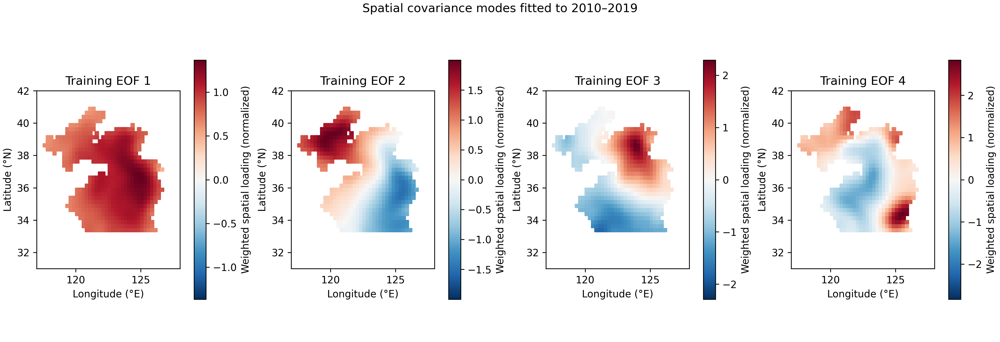
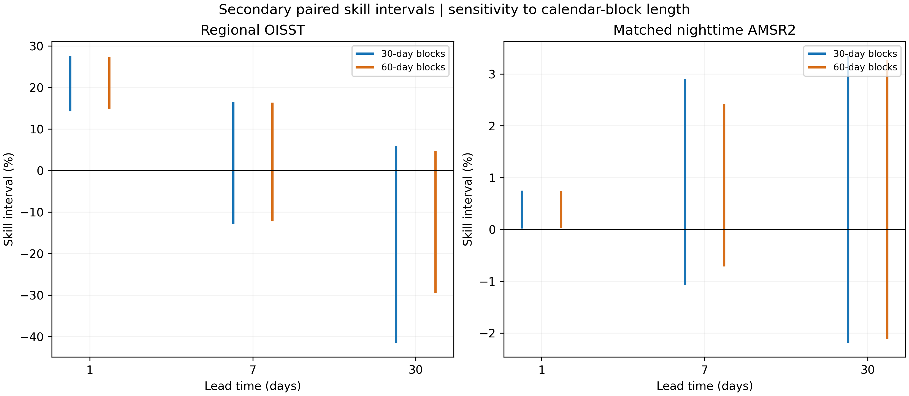

# Supplementary information

## Spatial aggregation and observation-source dependence of short-range SST forecast skill in the Yellow–Bohai Sea

### S1. Evidence chronology and frozen records

The original regional exploration uses 2010–2025 OISST and several chronological test folds. Its latest model uses 2010–2019 for fitting, 2020–2021 for selection, 2022 for symmetric interval calibration and 2023–2025 for historical testing. The temporal protocol was committed before acquiring January–August 2026 OISST targets. Its SHA-256 is 8a11e5b9b56845936cbd72495a2f066bd2d5ae2a2a9044bc18282169ce684aa4; protocol commit d0f6f17d84054df852c96640fe8ca5a9033c8fcf records the model choices.

The independent-instrument protocol was frozen after inspection of the OISST 2026 scores, but before reading the AMSR2 target values. Its SHA-256 is ecc8c46b5f2653dc2e4f3e636c9206a2460bbe2c5dd15123f82ad51cdaba2f03; protocol commit a3deb64aba90017d59b47ac1c9404f0efbe41ad7 records that design. The linked forecast, history and spatial-mask hashes are preserved in the protocol. The 2026 origin history was assembled from the already locked regional targets, requiring identical values where target records repeat; individual forecasts still access only their origin and earlier observations.

The spatial and diagnostic extension was designed on 9 October 2026 after all original outcomes had been viewed. Its local design record is not public preregistration and is not an untouched external test. Coefficients, EOFs and mode autoregressions are fitted only to the training period; candidate selection uses only the selection period. This is an important computational restriction, but the scientific decision to add these models and diagnostics remains retrospective. No frozen primary model, threshold, external bias or calibration radius was altered.

### S2. Source acquisition and decoding

Two hundred monthly NOAA OISST subsets cover the 6,087-date record and the 44×44 acquired grid. The fixed polygon mask comprises 651 cells. Each subset has its provider URL, acquisition metadata and SHA-256 checksum. The original regional means use single-precision xarray cosine weights and reductions, followed by CSV rounding; new spatial diagnostics use double-precision weights and losses. Their maximum regional-mean difference is approximately 1.23×10⁻⁵°C, within a documented 2×10⁻⁵°C precision check. Frozen forecasts and primary metrics retain their original arithmetic. New external RMSE replication must agree within 10⁻⁵°C and use exactly the original scoring-date counts.

RSS files follow the daily version 8.2 provider naming convention. Remote byte-range acquisition preserves strong entity tags and chunk hashes before writing the cropped subset. Arrays contain separate ascending and descending SST, UTC measurement times and the land, coast, sea-ice and no-observation masks. Per-subset checksums and all provider URLs are retained in the independent provenance record. Native cell centres match the OISST centres; no external spatial interpolation or gap filling is performed.

A complete 5 February 2026 source file was also downloaded and decoded with NetCDF automatic scale/mask handling, independently of the HDF5 byte-range subset path. SST, times and the four quality masks match exactly. The complete-file SHA-256 is 6eb061870361ee819ab39597debde4db61aa412381f6dc3c94c892378c0a858f. The audit tests extraction integrity; it is not an independent calibration or buoy comparison. Its date was selected after inspecting product differences, and no scoring rule changed as a result.

### S3. Spatial candidate calculation

The training seasonal field is an ordinary least-squares regression on an intercept and three sine/cosine pairs, with optional linear trend. Let a(d) be its residual field, W the diagonal normalized cosine-weight matrix and U the eigenvectors of the training covariance of W¹ᐟ²a. The weighted EOF scores are z(d)=UᵀW¹ᐟ²a(d). Retained score histories are fitted with autoregressions using an intercept. The reconstruction operator is B=W⁻¹ᐟ²U. Only retained modes are propagated; unresolved origin anomalies persist according to equation (2) in the main text.

EOF signs are fixed by choosing the sign of each column so that its largest absolute loading is positive. Sign conventions do not identify mechanisms or affect forecasts. The rank/order/trend combination is chosen by minimum seven-day mean daily complete-grid squared error during 2020–2021. Ties prefer lower rank, lower order and no trend. Unstable candidates are excluded before scoring. The selected rank is 10, order is 7, trend inclusion is true, and retained training variance is 84.5%. All selection scores appear below; there is no search over 2026 performance.

**Table S1. Training-only candidate selection.** RMSE is in °C. The table includes every eligible stationary candidate.

| Trend | Rank | Order | Selection days | Selection RMSE (°C) |
|---|---|---|---|---|
| False | 1 | 1 | 731 | 0.8513 |
| False | 3 | 1 | 731 | 0.8459 |
| False | 5 | 1 | 731 | 0.8422 |
| False | 10 | 1 | 731 | 0.8412 |
| False | 1 | 3 | 731 | 0.8594 |
| False | 3 | 3 | 731 | 0.8560 |
| False | 5 | 3 | 731 | 0.8533 |
| False | 10 | 3 | 731 | 0.8522 |
| False | 1 | 7 | 731 | 0.8567 |
| False | 3 | 7 | 731 | 0.8506 |
| False | 5 | 7 | 731 | 0.8459 |
| False | 10 | 7 | 731 | 0.8407 |
| True | 1 | 1 | 731 | 0.8441 |
| True | 3 | 1 | 731 | 0.8418 |
| True | 5 | 1 | 731 | 0.8420 |
| True | 10 | 1 | 731 | 0.8417 |
| True | 1 | 3 | 731 | 0.8475 |
| True | 3 | 3 | 731 | 0.8485 |
| True | 5 | 3 | 731 | 0.8491 |
| True | 10 | 3 | 731 | 0.8488 |
| True | 1 | 7 | 731 | 0.8467 |
| True | 3 | 7 | 731 | 0.8427 |
| True | 5 | 7 | 731 | 0.8398 |
| True | 10 | 7 | 731 | 0.8351 |

**Figure S1.** The first available retained modes are shown, up to four panels. Loadings are normalized for display, with sign conventions described above. They describe covariance structure on the fitted field, not independently established circulation or heat-flux mechanisms.

### S4. Calendar-block inference

The original paired daily bootstrap uses 1,000 replicates and 30- and 60-day blocks. The new secondary analysis uses 1,999 circular-block replicates, random seed 20261009, and retains unscored calendar dates as gaps. Every replicate draws one set of dates for both model and baseline. The difference series is centred at its observed mean to generate a null distribution for equal expected squared losses. The two-sided p value includes a one-count correction. Percentile intervals are calculated from paired RMSE skill and squared-loss advantage draws. At least 100 valid draws are required.

Separate six-member families are formed for each block length: regional OISST at three horizons and nighttime AMSR2 at three horizons. Holm adjustment uses the ordered p values with monotonically increasing adjusted values. Its family-wise interpretation depends on the validity of the individual p values; approximate stationary-loss assumptions and the short, seasonally evolving record remain limitations. Afternoon results and retrospective spatial controls are not added to this family and are not assigned adjusted confirmatory claims.

**Table S2. Secondary inference for the original frozen comparisons.** Skills and their bounds are fractions. These intervals use the new replicate count; the original published intervals remain the primary record.

| Target | Lead (d) | Block (d) | p bootstrap two sided | p holm six comparisons | Skill lower | Skill upper |
|---|---|---|---|---|---|---|
| Regional OISST (2026) | 1 | 30 | 0.0005 | 0.0030 | 0.1429 | 0.2767 |
| Regional OISST (2026) | 7 | 30 | 0.7780 | 1.0000 | -0.1292 | 0.1650 |
| Regional OISST (2026) | 30 | 30 | 0.1730 | 0.6920 | -0.4142 | 0.0600 |
| Nighttime AMSR2 (2026) | 1 | 30 | 0.0470 | 0.2350 | 0.0002 | 0.0075 |
| Nighttime AMSR2 (2026) | 7 | 30 | 0.2620 | 0.7860 | -0.0107 | 0.0290 |
| Nighttime AMSR2 (2026) | 30 | 30 | 0.6545 | 1.0000 | -0.0218 | 0.0335 |
| Regional OISST (2026) | 1 | 60 | 0.0005 | 0.0030 | 0.1492 | 0.2742 |
| Regional OISST (2026) | 7 | 60 | 0.7900 | 1.0000 | -0.1220 | 0.1637 |
| Regional OISST (2026) | 30 | 60 | 0.1575 | 0.6300 | -0.2948 | 0.0473 |
| Nighttime AMSR2 (2026) | 1 | 60 | 0.0665 | 0.3325 | 0.0003 | 0.0074 |
| Nighttime AMSR2 (2026) | 7 | 60 | 0.1890 | 0.6300 | -0.0071 | 0.0243 |
| Nighttime AMSR2 (2026) | 30 | 60 | 0.6860 | 1.0000 | -0.0212 | 0.0327 |

**Figure S2.** Secondary 95% skill intervals using thirty- and sixty-day blocks. The two panels correspond to the separate verification targets within the six-comparison family. The figure does not establish validity of stationary-block inference for a seasonally varying eight-month sample.

### S5. Seasonal scores and calibrated interval quality

Seasons use calendar months: DJF (December–February), MAM (March–May), JJA (June–August) and SON (September–November). The historical evaluation has three full annual cycles; the 2026 evaluation has January–August only. No 2026 SON values are filled. The 2026 DJF subset lacks December and should not be directly interpreted as the same seasonal exposure as historical DJF. The number of scored dates accompanies each summary.

**Table S3. Seasonal regional errors for the frozen selected projection.** RMSE and bias are in °C. Double-precision spatial projection arithmetic can differ slightly from the original region-only calculation.

| Period | Lead (d) | season | Days | RMSE (°C) | Bias (°C) |
|---|---|---|---|---|---|
| 2023-2025 | 1 | DJF | 271 | 0.0832 | 0.0028 |
| 2023-2025 | 1 | JJA | 276 | 0.1591 | -0.0210 |
| 2023-2025 | 1 | MAM | 276 | 0.1342 | 0.0255 |
| 2023-2025 | 1 | SON | 273 | 0.1224 | -0.0071 |
| 2023-2025 | 7 | DJF | 271 | 0.3454 | 0.0261 |
| 2023-2025 | 7 | JJA | 276 | 0.7530 | -0.1499 |
| 2023-2025 | 7 | MAM | 276 | 0.5189 | 0.1471 |
| 2023-2025 | 7 | SON | 273 | 0.5215 | -0.0202 |
| 2023-2025 | 30 | DJF | 271 | 0.4128 | 0.1630 |
| 2023-2025 | 30 | JJA | 276 | 1.1370 | -0.4129 |
| 2023-2025 | 30 | MAM | 276 | 0.7312 | 0.4377 |
| 2023-2025 | 30 | SON | 273 | 0.6870 | -0.1396 |
| 2026-Jan-Aug | 1 | DJF | 59 | 0.0720 | 0.0237 |
| 2026-Jan-Aug | 1 | JJA | 92 | 0.1432 | -0.0103 |
| 2026-Jan-Aug | 1 | MAM | 92 | 0.1227 | 0.0118 |
| 2026-Jan-Aug | 7 | DJF | 59 | 0.2595 | 0.1239 |
| 2026-Jan-Aug | 7 | JJA | 92 | 0.7468 | -0.1240 |
| 2026-Jan-Aug | 7 | MAM | 92 | 0.5253 | 0.0908 |
| 2026-Jan-Aug | 30 | DJF | 59 | 0.4175 | 0.3507 |
| 2026-Jan-Aug | 30 | JJA | 92 | 1.0638 | -0.2154 |
| 2026-Jan-Aug | 30 | MAM | 92 | 0.4825 | 0.2913 |

For interval limits l and u, observed SST y and nominal miscoverage α=0.05, the interval score is (u−l)+(2/α)(l−y) when y<l, or (u−l)+(2/α)(y−u) when y>u, and equals the width otherwise. We report coverage, mean width and mean score for the already frozen radii, without recalibration. The score is proper for the target quantiles, but empirical performance under serial dependence and drift must still be assessed.

**Table S4. 2026 regional interval diagnostics by model, horizon and season.** Coverage is a fraction; width and interval score are in °C. This table includes baselines and is distinct from external gridded verification.

| Lead (d) | Method | season | Days | coverage | mean interval score celsius | mean width celsius |
|---|---|---|---|---|---|---|
| 7 | ar_harmonic_trend | DJF | 59 | 1.0000 | 2.0388 | 2.0388 |
| 7 | ar_harmonic_trend | JJA | 92 | 0.8696 | 4.4802 | 2.0388 |
| 7 | ar_harmonic_trend | MAM | 92 | 0.9674 | 2.2807 | 2.0388 |
| 30 | ar_harmonic_trend | DJF | 59 | 1.0000 | 3.3633 | 3.3633 |
| 30 | ar_harmonic_trend | JJA | 92 | 0.9348 | 4.1804 | 3.3633 |
| 30 | ar_harmonic_trend | MAM | 92 | 1.0000 | 3.3633 | 3.3633 |
| 1 | persistence | DJF | 59 | 1.0000 | 0.6515 | 0.6515 |
| 1 | persistence | JJA | 92 | 0.9457 | 0.7917 | 0.6515 |
| 1 | persistence | MAM | 92 | 0.9457 | 0.8696 | 0.6515 |
| 7 | persistence | DJF | 59 | 1.0000 | 2.0890 | 2.0890 |
| 7 | persistence | JJA | 92 | 0.8152 | 3.6009 | 2.0890 |
| 7 | persistence | MAM | 92 | 0.9022 | 2.7671 | 2.0890 |
| 30 | persistence | DJF | 59 | 1.0000 | 3.6463 | 3.6463 |
| 30 | persistence | JJA | 92 | 0.9891 | 3.6489 | 3.6463 |
| 30 | persistence | MAM | 92 | 1.0000 | 3.6463 | 3.6463 |
| 1 | ridge_harmonic_trend | DJF | 59 | 1.0000 | 0.5288 | 0.5288 |
| 1 | ridge_harmonic_trend | JJA | 92 | 0.9348 | 0.6034 | 0.5288 |
| 1 | ridge_harmonic_trend | MAM | 92 | 0.9565 | 0.6561 | 0.5288 |

### S6. Surface memory and sampling diagnostics

Training-only regional residuals subtract an estimated harmonic cycle and trend. For each lag, both endpoints must fall within the same named season. Pearson correlations use those pairs only. Lag-one linear coefficients and conditional AR(1) half-lives, where 0<φ<1, are included in the accompanying CSV. These are sample descriptors, not demonstrated physical relaxation times. Seasonal reemergence cannot be inferred without subsurface and heat-budget evidence.

**Table S5. Same-season lagged associations in the training regional series.** No 2026 observations enter these values.

| season | lag days | n pairs | correlation |
|---|---|---|---|
| DJF | 1 | 891 | 0.9744 |
| DJF | 7 | 825 | 0.7699 |
| DJF | 30 | 572 | 0.4562 |
| MAM | 1 | 910 | 0.9570 |
| MAM | 7 | 850 | 0.5986 |
| MAM | 30 | 620 | 0.4584 |
| JJA | 1 | 910 | 0.9687 |
| JJA | 7 | 850 | 0.6724 |
| JJA | 30 | 620 | 0.0955 |
| SON | 1 | 900 | 0.9576 |
| SON | 7 | 840 | 0.6158 |
| SON | 30 | 610 | 0.0468 |

Grid-to-land distance is the minimum spherical distance from an ocean cell centre to a cell missing OISST on 1 January 2010 within the 44×44 acquisition box. Bins are [0,50), [50,100) and [100,10000) km. The proxy is bounded by this box and does not represent the nearest high-resolution coastline. On each scored date, discrepancies are first weighted within each available bin and then averaged equally over its dates. Different bins and seasons can have different cell–date compositions, so their differences are descriptive rather than controlled estimates of distance effects.

**Table S6. Seasonal product differences by land-distance proxy.** RMS difference and bias (OISST minus AMSR2) are in °C. Date counts, cell–date counts and pass labels specify the available support.

| Pass | distance proxy bin | season | Days | n cell day pairs | rms difference | bias |
|---|---|---|---|---|---|---|
| Afternoon | 0-50 | JJA | 3 | 3 | 1.9763 | -1.8938 |
| Afternoon | 0-50 | MAM | 1 | 1 | 1.1960 | -1.1960 |
| Afternoon | 100-10000 | DJF | 52 | 10236 | 0.8103 | 0.1685 |
| Afternoon | 100-10000 | JJA | 84 | 13650 | 1.6504 | -1.1771 |
| Afternoon | 100-10000 | MAM | 79 | 14835 | 2.2136 | -1.0981 |
| Afternoon | 50-100 | DJF | 52 | 2786 | 1.1697 | -0.0011 |
| Afternoon | 50-100 | JJA | 84 | 3682 | 2.1632 | -1.5108 |
| Afternoon | 50-100 | MAM | 79 | 3886 | 2.4045 | -1.2904 |
| Nighttime | 0-50 | DJF | 1 | 1 | 1.9050 | 1.9050 |
| Nighttime | 100-10000 | DJF | 55 | 9830 | 2.2149 | -0.4685 |
| Nighttime | 100-10000 | JJA | 84 | 12454 | 1.7723 | -0.8282 |
| Nighttime | 100-10000 | MAM | 86 | 14272 | 2.3389 | -0.7849 |
| Nighttime | 50-100 | DJF | 55 | 2614 | 1.7917 | -0.3533 |
| Nighttime | 50-100 | JJA | 84 | 3381 | 1.8442 | -0.9025 |
| Nighttime | 50-100 | MAM | 85 | 3841 | 2.1850 | -0.8192 |

### S7. Complete spatial comparison results

**Table S7. All spatial evaluation metrics.** Both skill columns are fractions. Frozen anomaly projection and grid-specific anomaly persistence are different baselines. Each within-target comparison uses identical masks and dates; across-target differences may reflect spatial support as well as the source. Raw grid persistence is retained as a secondary reference.

| Period | Target | Pass | Lead (d) | Method | Days | RMSE (°C) | Skill vs frozen persistence | Skill vs grid persistence |
|---|---|---|---|---|---|---|---|---|
| 2023-2025 | Full-grid OISST | all | 1 | EOF–AR spatial increments | 1096 | 0.2431 | 0.0710 | 0.0348 |
| 2023-2025 | Full-grid OISST | all | 1 | Frozen regional persistence | 1096 | 0.2617 | 0.0000 | -0.0390 |
| 2023-2025 | Full-grid OISST | all | 1 | Frozen regional forecast | 1096 | 0.2405 | 0.0811 | 0.0453 |
| 2023-2025 | Full-grid OISST | all | 1 | Grid anomaly persistence | 1096 | 0.2519 | 0.0375 | 0.0000 |
| 2023-2025 | Full-grid OISST | all | 1 | Raw grid persistence | 1096 | 0.2844 | -0.0868 | -0.1292 |
| 2023-2025 | Full-grid OISST | all | 7 | EOF–AR spatial increments | 1096 | 0.8228 | 0.0321 | -0.0078 |
| 2023-2025 | Full-grid OISST | all | 7 | Frozen regional persistence | 1096 | 0.8501 | 0.0000 | -0.0412 |
| 2023-2025 | Full-grid OISST | all | 7 | Frozen regional forecast | 1096 | 0.8098 | 0.0474 | 0.0081 |
| 2023-2025 | Full-grid OISST | all | 7 | Grid anomaly persistence | 1096 | 0.8165 | 0.0396 | 0.0000 |
| 2023-2025 | Full-grid OISST | all | 7 | Raw grid persistence | 1096 | 1.2346 | -0.4523 | -0.5121 |
| 2023-2025 | Full-grid OISST | all | 30 | EOF–AR spatial increments | 1096 | 1.2580 | 0.1589 | 0.0375 |
| 2023-2025 | Full-grid OISST | all | 30 | Frozen regional persistence | 1096 | 1.4956 | 0.0000 | -0.1443 |
| 2023-2025 | Full-grid OISST | all | 30 | Frozen regional forecast | 1096 | 1.4153 | 0.0537 | -0.0828 |
| 2023-2025 | Full-grid OISST | all | 30 | Grid anomaly persistence | 1096 | 1.3071 | 0.1261 | 0.0000 |
| 2023-2025 | Full-grid OISST | all | 30 | Raw grid persistence | 1096 | 4.1514 | -1.7757 | -2.1761 |
| 2023-2025 | Regional OISST | all | 1 | EOF–AR spatial increments | 1096 | 0.1277 | 0.2230 | 0.1519 |
| 2023-2025 | Regional OISST | all | 1 | Frozen regional persistence | 1096 | 0.1643 | 0.0000 | -0.0915 |
| 2023-2025 | Regional OISST | all | 1 | Frozen regional forecast | 1096 | 0.1279 | 0.2219 | 0.1507 |
| 2023-2025 | Regional OISST | all | 1 | Grid anomaly persistence | 1096 | 0.1506 | 0.0839 | 0.0000 |
| 2023-2025 | Regional OISST | all | 1 | Raw grid persistence | 1096 | 0.1985 | -0.2079 | -0.3185 |
| 2023-2025 | Regional OISST | all | 7 | EOF–AR spatial increments | 1096 | 0.5546 | 0.0940 | 0.0664 |
| 2023-2025 | Regional OISST | all | 7 | Frozen regional persistence | 1096 | 0.6121 | 0.0000 | -0.0305 |
| 2023-2025 | Regional OISST | all | 7 | Frozen regional forecast | 1096 | 0.5548 | 0.0936 | 0.0660 |
| 2023-2025 | Regional OISST | all | 7 | Grid anomaly persistence | 1096 | 0.5940 | 0.0296 | 0.0000 |
| 2023-2025 | Regional OISST | all | 7 | Raw grid persistence | 1096 | 1.0845 | -0.7717 | -0.8257 |
| 2023-2025 | Regional OISST | all | 30 | EOF–AR spatial increments | 1096 | 0.7977 | 0.1367 | 0.1763 |
| 2023-2025 | Regional OISST | all | 30 | Frozen regional persistence | 1096 | 0.9240 | 0.0000 | 0.0459 |
| 2023-2025 | Regional OISST | all | 30 | Frozen regional forecast | 1096 | 0.7873 | 0.1479 | 0.1870 |
| 2023-2025 | Regional OISST | all | 30 | Grid anomaly persistence | 1096 | 0.9685 | -0.0482 | 0.0000 |
| 2023-2025 | Regional OISST | all | 30 | Raw grid persistence | 1096 | 3.9813 | -3.3089 | -3.1109 |
| 2026-Jan-Aug | Full-grid OISST | all | 1 | EOF–AR spatial increments | 243 | 0.2410 | 0.0662 | 0.0410 |
| 2026-Jan-Aug | Full-grid OISST | all | 1 | Frozen regional persistence | 243 | 0.2581 | 0.0000 | -0.0270 |
| 2026-Jan-Aug | Full-grid OISST | all | 1 | Frozen regional forecast | 243 | 0.2402 | 0.0694 | 0.0443 |
| 2026-Jan-Aug | Full-grid OISST | all | 1 | Grid anomaly persistence | 243 | 0.2513 | 0.0263 | 0.0000 |
| 2026-Jan-Aug | Full-grid OISST | all | 1 | Raw grid persistence | 243 | 0.2789 | -0.0806 | -0.1097 |
| 2026-Jan-Aug | Full-grid OISST | all | 7 | EOF–AR spatial increments | 243 | 0.7998 | 0.0318 | 0.0297 |
| 2026-Jan-Aug | Full-grid OISST | all | 7 | Frozen regional persistence | 243 | 0.8261 | 0.0000 | -0.0023 |
| 2026-Jan-Aug | Full-grid OISST | all | 7 | Frozen regional forecast | 243 | 0.8161 | 0.0121 | 0.0099 |
| 2026-Jan-Aug | Full-grid OISST | all | 7 | Grid anomaly persistence | 243 | 0.8243 | 0.0022 | 0.0000 |
| 2026-Jan-Aug | Full-grid OISST | all | 7 | Raw grid persistence | 243 | 1.1774 | -0.4253 | -0.4285 |
| 2026-Jan-Aug | Full-grid OISST | all | 30 | EOF–AR spatial increments | 243 | 1.1102 | 0.1335 | 0.0879 |
| 2026-Jan-Aug | Full-grid OISST | all | 30 | Frozen regional persistence | 243 | 1.2812 | 0.0000 | -0.0525 |
| 2026-Jan-Aug | Full-grid OISST | all | 30 | Frozen regional forecast | 243 | 1.3366 | -0.0433 | -0.0981 |
| 2026-Jan-Aug | Full-grid OISST | all | 30 | Grid anomaly persistence | 243 | 1.2172 | 0.0499 | 0.0000 |
| 2026-Jan-Aug | Full-grid OISST | all | 30 | Raw grid persistence | 243 | 3.8702 | -2.0209 | -2.1796 |
| 2026-Jan-Aug | Matched AMSR2 | Afternoon | 1 | EOF–AR spatial increments | 215 | 1.8415 | 0.0069 | 0.0092 |
| 2026-Jan-Aug | Matched AMSR2 | Afternoon | 1 | Frozen regional persistence | 215 | 1.8543 | 0.0000 | 0.0023 |
| 2026-Jan-Aug | Matched AMSR2 | Afternoon | 1 | Frozen regional forecast | 215 | 1.8457 | 0.0047 | 0.0070 |
| 2026-Jan-Aug | Matched AMSR2 | Afternoon | 1 | Grid anomaly persistence | 215 | 1.8586 | -0.0023 | 0.0000 |
| 2026-Jan-Aug | Matched AMSR2 | Afternoon | 1 | Raw grid persistence | 215 | 1.9237 | -0.0374 | -0.0350 |
| 2026-Jan-Aug | Matched AMSR2 | Afternoon | 7 | EOF–AR spatial increments | 215 | 1.9730 | 0.0314 | 0.0467 |
| 2026-Jan-Aug | Matched AMSR2 | Afternoon | 7 | Frozen regional persistence | 215 | 2.0368 | 0.0000 | 0.0158 |
| 2026-Jan-Aug | Matched AMSR2 | Afternoon | 7 | Frozen regional forecast | 215 | 2.0174 | 0.0095 | 0.0252 |
| 2026-Jan-Aug | Matched AMSR2 | Afternoon | 7 | Grid anomaly persistence | 215 | 2.0696 | -0.0161 | 0.0000 |
| 2026-Jan-Aug | Matched AMSR2 | Afternoon | 7 | Raw grid persistence | 215 | 2.5711 | -0.2623 | -0.2423 |
| 2026-Jan-Aug | Matched AMSR2 | Afternoon | 30 | EOF–AR spatial increments | 215 | 1.9882 | 0.0832 | 0.1318 |
| 2026-Jan-Aug | Matched AMSR2 | Afternoon | 30 | Frozen regional persistence | 215 | 2.1686 | 0.0000 | 0.0531 |
| 2026-Jan-Aug | Matched AMSR2 | Afternoon | 30 | Frozen regional forecast | 215 | 2.1396 | 0.0134 | 0.0657 |
| 2026-Jan-Aug | Matched AMSR2 | Afternoon | 30 | Grid anomaly persistence | 215 | 2.2901 | -0.0560 | 0.0000 |
| 2026-Jan-Aug | Matched AMSR2 | Afternoon | 30 | Raw grid persistence | 215 | 4.9499 | -1.2825 | -1.1614 |
| 2026-Jan-Aug | Matched AMSR2 | Nighttime | 1 | EOF–AR spatial increments | 225 | 2.1052 | 0.0064 | 0.0081 |
| 2026-Jan-Aug | Matched AMSR2 | Nighttime | 1 | Frozen regional persistence | 225 | 2.1189 | 0.0000 | 0.0017 |
| 2026-Jan-Aug | Matched AMSR2 | Nighttime | 1 | Frozen regional forecast | 225 | 2.1108 | 0.0038 | 0.0055 |
| 2026-Jan-Aug | Matched AMSR2 | Nighttime | 1 | Grid anomaly persistence | 225 | 2.1224 | -0.0017 | 0.0000 |
| 2026-Jan-Aug | Matched AMSR2 | Nighttime | 1 | Raw grid persistence | 225 | 2.1635 | -0.0211 | -0.0194 |
| 2026-Jan-Aug | Matched AMSR2 | Nighttime | 7 | EOF–AR spatial increments | 225 | 2.1852 | 0.0297 | 0.0369 |
| 2026-Jan-Aug | Matched AMSR2 | Nighttime | 7 | Frozen regional persistence | 225 | 2.2521 | 0.0000 | 0.0074 |
| 2026-Jan-Aug | Matched AMSR2 | Nighttime | 7 | Frozen regional forecast | 225 | 2.2264 | 0.0114 | 0.0187 |
| 2026-Jan-Aug | Matched AMSR2 | Nighttime | 7 | Grid anomaly persistence | 225 | 2.2688 | -0.0074 | 0.0000 |
| 2026-Jan-Aug | Matched AMSR2 | Nighttime | 7 | Raw grid persistence | 225 | 2.6272 | -0.1666 | -0.1580 |
| 2026-Jan-Aug | Matched AMSR2 | Nighttime | 30 | EOF–AR spatial increments | 225 | 2.1923 | 0.0746 | 0.0893 |
| 2026-Jan-Aug | Matched AMSR2 | Nighttime | 30 | Frozen regional persistence | 225 | 2.3691 | 0.0000 | 0.0158 |
| 2026-Jan-Aug | Matched AMSR2 | Nighttime | 30 | Frozen regional forecast | 225 | 2.3533 | 0.0067 | 0.0224 |
| 2026-Jan-Aug | Matched AMSR2 | Nighttime | 30 | Grid anomaly persistence | 225 | 2.4072 | -0.0161 | 0.0000 |
| 2026-Jan-Aug | Matched AMSR2 | Nighttime | 30 | Raw grid persistence | 225 | 4.7577 | -1.0082 | -0.9764 |
| 2026-Jan-Aug | Matched OISST | Afternoon | 1 | EOF–AR spatial increments | 215 | 0.2201 | 0.0958 | 0.0492 |
| 2026-Jan-Aug | Matched OISST | Afternoon | 1 | Frozen regional persistence | 215 | 0.2435 | 0.0000 | -0.0515 |
| 2026-Jan-Aug | Matched OISST | Afternoon | 1 | Frozen regional forecast | 215 | 0.2222 | 0.0873 | 0.0403 |
| 2026-Jan-Aug | Matched OISST | Afternoon | 1 | Grid anomaly persistence | 215 | 0.2315 | 0.0489 | 0.0000 |
| 2026-Jan-Aug | Matched OISST | Afternoon | 1 | Raw grid persistence | 215 | 0.2596 | -0.0664 | -0.1213 |
| 2026-Jan-Aug | Matched OISST | Afternoon | 7 | EOF–AR spatial increments | 215 | 0.7798 | 0.0206 | 0.0489 |
| 2026-Jan-Aug | Matched OISST | Afternoon | 7 | Frozen regional persistence | 215 | 0.7962 | 0.0000 | 0.0289 |
| 2026-Jan-Aug | Matched OISST | Afternoon | 7 | Frozen regional forecast | 215 | 0.8114 | -0.0191 | 0.0103 |
| 2026-Jan-Aug | Matched OISST | Afternoon | 7 | Grid anomaly persistence | 215 | 0.8199 | -0.0297 | 0.0000 |
| 2026-Jan-Aug | Matched OISST | Afternoon | 7 | Raw grid persistence | 215 | 1.1654 | -0.4638 | -0.4215 |
| 2026-Jan-Aug | Matched OISST | Afternoon | 30 | EOF–AR spatial increments | 215 | 1.0410 | 0.1176 | 0.1700 |
| 2026-Jan-Aug | Matched OISST | Afternoon | 30 | Frozen regional persistence | 215 | 1.1797 | 0.0000 | 0.0594 |
| 2026-Jan-Aug | Matched OISST | Afternoon | 30 | Frozen regional forecast | 215 | 1.2971 | -0.0996 | -0.0342 |
| 2026-Jan-Aug | Matched OISST | Afternoon | 30 | Grid anomaly persistence | 215 | 1.2542 | -0.0632 | 0.0000 |
| 2026-Jan-Aug | Matched OISST | Afternoon | 30 | Raw grid persistence | 215 | 3.7173 | -2.1511 | -1.9639 |
| 2026-Jan-Aug | Matched OISST | Nighttime | 1 | EOF–AR spatial increments | 225 | 0.2426 | 0.0796 | 0.0624 |
| 2026-Jan-Aug | Matched OISST | Nighttime | 1 | Frozen regional persistence | 225 | 0.2636 | 0.0000 | -0.0187 |
| 2026-Jan-Aug | Matched OISST | Nighttime | 1 | Frozen regional forecast | 225 | 0.2436 | 0.0759 | 0.0587 |
| 2026-Jan-Aug | Matched OISST | Nighttime | 1 | Grid anomaly persistence | 225 | 0.2587 | 0.0184 | 0.0000 |
| 2026-Jan-Aug | Matched OISST | Nighttime | 1 | Raw grid persistence | 225 | 0.2790 | -0.0585 | -0.0783 |
| 2026-Jan-Aug | Matched OISST | Nighttime | 7 | EOF–AR spatial increments | 225 | 0.7898 | 0.0392 | 0.0548 |
| 2026-Jan-Aug | Matched OISST | Nighttime | 7 | Frozen regional persistence | 225 | 0.8220 | 0.0000 | 0.0162 |
| 2026-Jan-Aug | Matched OISST | Nighttime | 7 | Frozen regional forecast | 225 | 0.8164 | 0.0068 | 0.0229 |
| 2026-Jan-Aug | Matched OISST | Nighttime | 7 | Grid anomaly persistence | 225 | 0.8355 | -0.0164 | 0.0000 |
| 2026-Jan-Aug | Matched OISST | Nighttime | 7 | Raw grid persistence | 225 | 1.1408 | -0.3878 | -0.3654 |
| 2026-Jan-Aug | Matched OISST | Nighttime | 30 | EOF–AR spatial increments | 225 | 1.0298 | 0.1066 | 0.1379 |
| 2026-Jan-Aug | Matched OISST | Nighttime | 30 | Frozen regional persistence | 225 | 1.1527 | 0.0000 | 0.0350 |
| 2026-Jan-Aug | Matched OISST | Nighttime | 30 | Frozen regional forecast | 225 | 1.2610 | -0.0939 | -0.0556 |
| 2026-Jan-Aug | Matched OISST | Nighttime | 30 | Grid anomaly persistence | 225 | 1.1946 | -0.0363 | 0.0000 |
| 2026-Jan-Aug | Matched OISST | Nighttime | 30 | Raw grid persistence | 225 | 3.6868 | -2.1983 | -2.0863 |
| 2026-Jan-Aug | Regional OISST | all | 1 | EOF–AR spatial increments | 243 | 0.1220 | 0.2065 | 0.1535 |
| 2026-Jan-Aug | Regional OISST | all | 1 | Frozen regional persistence | 243 | 0.1538 | 0.0000 | -0.0669 |
| 2026-Jan-Aug | Regional OISST | all | 1 | Frozen regional forecast | 243 | 0.1213 | 0.2109 | 0.1582 |
| 2026-Jan-Aug | Regional OISST | all | 1 | Grid anomaly persistence | 243 | 0.1441 | 0.0627 | 0.0000 |
| 2026-Jan-Aug | Regional OISST | all | 1 | Raw grid persistence | 243 | 0.1866 | -0.2134 | -0.2945 |
| 2026-Jan-Aug | Regional OISST | all | 7 | EOF–AR spatial increments | 243 | 0.5672 | 0.0391 | 0.0730 |
| 2026-Jan-Aug | Regional OISST | all | 7 | Frozen regional persistence | 243 | 0.5903 | 0.0000 | 0.0353 |
| 2026-Jan-Aug | Regional OISST | all | 7 | Frozen regional forecast | 243 | 0.5762 | 0.0239 | 0.0584 |
| 2026-Jan-Aug | Regional OISST | all | 7 | Grid anomaly persistence | 243 | 0.6119 | -0.0366 | 0.0000 |
| 2026-Jan-Aug | Regional OISST | all | 7 | Raw grid persistence | 243 | 1.0258 | -0.7378 | -0.6765 |
| 2026-Jan-Aug | Regional OISST | all | 30 | EOF–AR spatial increments | 243 | 0.7441 | -0.1568 | 0.1639 |
| 2026-Jan-Aug | Regional OISST | all | 30 | Frozen regional persistence | 243 | 0.6432 | 0.0000 | 0.2772 |
| 2026-Jan-Aug | Regional OISST | all | 30 | Frozen regional forecast | 243 | 0.7476 | -0.1623 | 0.1600 |
| 2026-Jan-Aug | Regional OISST | all | 30 | Grid anomaly persistence | 243 | 0.8900 | -0.3836 | 0.0000 |
| 2026-Jan-Aug | Regional OISST | all | 30 | Raw grid persistence | 243 | 3.7083 | -4.7649 | -3.1666 |

### S8. Reproduction and integrity checks

**Table S8. Descriptive paired block intervals for the retrospective EOF–AR control.** Each skill interval is relative to the named baseline and uses a common scoring support. These unadjusted intervals are exploratory; no p-value claim is added to the frozen six-comparison family.

| Period | Target | Lead (d) | Baseline | Block (d) | Skill lower | Skill upper |
|---|---|---|---|---|---|---|
| 2023-2025 | Full-grid OISST | 1 | Frozen regional persistence | 30 | 0.0528 | 0.0877 |
| 2023-2025 | Full-grid OISST | 1 | Frozen regional persistence | 60 | 0.0520 | 0.0871 |
| 2023-2025 | Full-grid OISST | 1 | Grid anomaly persistence | 30 | 0.0131 | 0.0544 |
| 2023-2025 | Full-grid OISST | 1 | Grid anomaly persistence | 60 | 0.0107 | 0.0564 |
| 2023-2025 | Full-grid OISST | 7 | Frozen regional persistence | 30 | -0.0119 | 0.0695 |
| 2023-2025 | Full-grid OISST | 7 | Frozen regional persistence | 60 | -0.0085 | 0.0709 |
| 2023-2025 | Full-grid OISST | 7 | Grid anomaly persistence | 30 | -0.0611 | 0.0371 |
| 2023-2025 | Full-grid OISST | 7 | Grid anomaly persistence | 60 | -0.0648 | 0.0393 |
| 2023-2025 | Full-grid OISST | 30 | Frozen regional persistence | 30 | 0.0906 | 0.2222 |
| 2023-2025 | Full-grid OISST | 30 | Frozen regional persistence | 60 | 0.0873 | 0.2307 |
| 2023-2025 | Full-grid OISST | 30 | Grid anomaly persistence | 30 | -0.0772 | 0.1251 |
| 2023-2025 | Full-grid OISST | 30 | Grid anomaly persistence | 60 | -0.0828 | 0.1305 |
| 2026-Jan-Aug | Full-grid OISST | 1 | Frozen regional persistence | 30 | 0.0437 | 0.0849 |
| 2026-Jan-Aug | Full-grid OISST | 1 | Frozen regional persistence | 60 | 0.0502 | 0.0818 |
| 2026-Jan-Aug | Full-grid OISST | 1 | Grid anomaly persistence | 30 | 0.0147 | 0.0650 |
| 2026-Jan-Aug | Full-grid OISST | 1 | Grid anomaly persistence | 60 | 0.0227 | 0.0537 |
| 2026-Jan-Aug | Full-grid OISST | 7 | Frozen regional persistence | 30 | -0.0517 | 0.1143 |
| 2026-Jan-Aug | Full-grid OISST | 7 | Frozen regional persistence | 60 | -0.0431 | 0.1050 |
| 2026-Jan-Aug | Full-grid OISST | 7 | Grid anomaly persistence | 30 | -0.0413 | 0.0757 |
| 2026-Jan-Aug | Full-grid OISST | 7 | Grid anomaly persistence | 60 | -0.0230 | 0.0579 |
| 2026-Jan-Aug | Full-grid OISST | 30 | Frozen regional persistence | 30 | 0.0221 | 0.2540 |
| 2026-Jan-Aug | Full-grid OISST | 30 | Frozen regional persistence | 60 | 0.0274 | 0.2806 |
| 2026-Jan-Aug | Full-grid OISST | 30 | Grid anomaly persistence | 30 | -0.1062 | 0.2069 |
| 2026-Jan-Aug | Full-grid OISST | 30 | Grid anomaly persistence | 60 | -0.1208 | 0.1878 |
| 2026-Jan-Aug | Matched AMSR2 | 1 | Frozen regional persistence | 30 | 0.0016 | 0.0115 |
| 2026-Jan-Aug | Matched AMSR2 | 1 | Frozen regional persistence | 60 | 0.0010 | 0.0122 |
| 2026-Jan-Aug | Matched AMSR2 | 1 | Grid anomaly persistence | 30 | 0.0034 | 0.0136 |
| 2026-Jan-Aug | Matched AMSR2 | 1 | Grid anomaly persistence | 60 | 0.0025 | 0.0139 |
| 2026-Jan-Aug | Matched AMSR2 | 7 | Frozen regional persistence | 30 | 0.0122 | 0.0492 |
| 2026-Jan-Aug | Matched AMSR2 | 7 | Frozen regional persistence | 60 | 0.0109 | 0.0475 |
| 2026-Jan-Aug | Matched AMSR2 | 7 | Grid anomaly persistence | 30 | 0.0122 | 0.0623 |
| 2026-Jan-Aug | Matched AMSR2 | 7 | Grid anomaly persistence | 60 | 0.0095 | 0.0625 |
| 2026-Jan-Aug | Matched AMSR2 | 30 | Frozen regional persistence | 30 | 0.0366 | 0.1191 |
| 2026-Jan-Aug | Matched AMSR2 | 30 | Frozen regional persistence | 60 | 0.0378 | 0.1156 |
| 2026-Jan-Aug | Matched AMSR2 | 30 | Grid anomaly persistence | 30 | 0.0220 | 0.1571 |
| 2026-Jan-Aug | Matched AMSR2 | 30 | Grid anomaly persistence | 60 | 0.0105 | 0.1640 |

Reproduction proceeds through the original historical research, the frozen OISST validation, the frozen AMSR2 validation, and then the publication extension. The extension entry point is `python -m src.publication`, with `configs/publication.json` defining the explicit candidate grid, temporal boundaries and scoring rules. Frozen protocol hashes are checked on input. NOAA subset and AMSR2 subset hashes are checked before scoring. The fixed field has consecutive daily dates, matching coordinates and finite ocean values. No candidate fitting routine reads selection or evaluation observations to estimate parameters.

Daily CSVs retain errors, masks/counts and all loss components; aggregate tables average those daily quantities. Both exact identities are checked on every matched scoring date with an absolute 10⁻¹⁰°C² threshold. The maximum observed residual in the loss decomposition is 2.13e-14°C². Altering future values in dedicated tests cannot change training parameters or an origin-restricted forecast. Further tests cover paired support, multiplicity adjustment, cancellation of discrepancy loss by a negative interaction, and interval-score penalties.

The generated manuscript and supplement draw tables directly from the analysis outputs. Figures are supplied in 300 dpi PNG and scalable SVG formats, with checksums. Protocol records include software hashes, provider acquisition hashes, exact model parameters, seeds and analysis scope. No reference to an open repository substitutes for an immutable archived release DOI; such a deposition should accompany final submission. Author identities, affiliations, funding, conflicts and contributor roles must be confirmed separately before submission.
