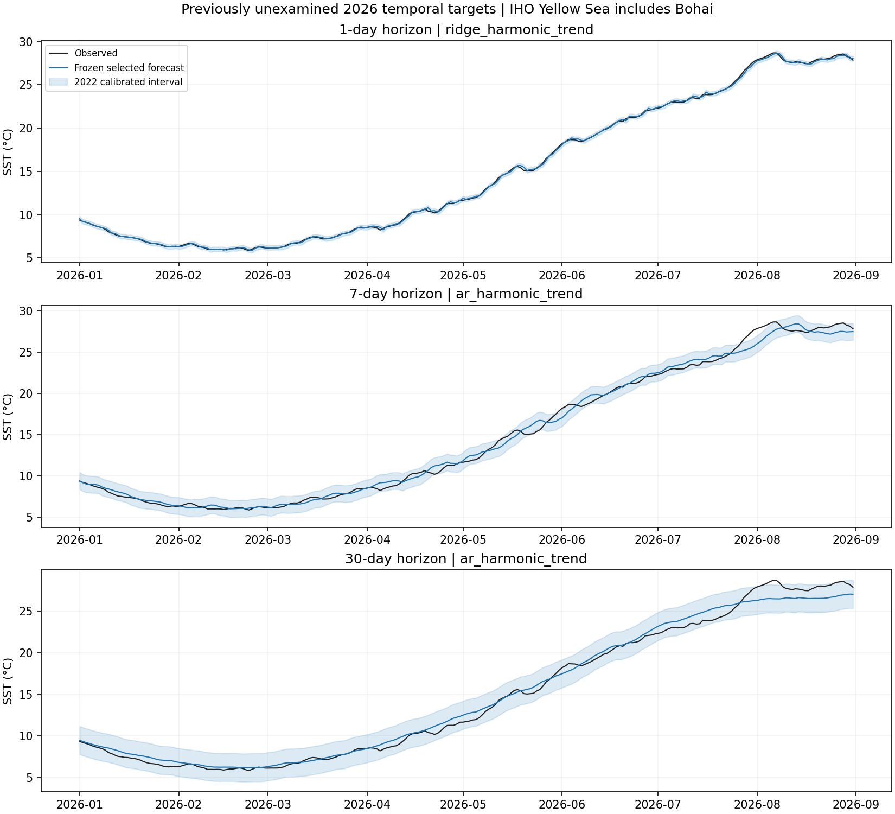

# 黄海项目：2026 年冻结方案时间验证

## 验证性质

本次先固定方案、模型与区间，再获取此前未查看的 2026 年 1—8 月目标数据。2010—2025 年研究成绩已经被查看；本次属于同一 OISST 产品的新时期检验，不能称为独立实测数据验证或实时预报。主区域沿用包含渤海的 IHO 定义。

## 固定规则

2010—2019 年拟合参数；2020—2021 年选择 AR 阶数、岭惩罚和每个步长的最终方法；2022 年固定区间；2023—2025 年不参与此次拟合、选择或校准，仅 2025 年末观测提供 2026 年初预测的起点。每个目标日仍只读取 d−h 及更早观测。

冻结时间（UTC）：2026-10-03T06:51:16.793456+00:00。完整系数、季节均值、校准半径、掩膜和历史来源校验和见 frozen_protocol.json；本次冻结文件 SHA-256：8a11e5b9b56845936cbd72495a2f066bd2d5ae2a2a9044bc18282169ce684aa4。

候选列表含八种方法和强基线。最终方法按各步长的共同日期选择期 RMSE 最小值决定；不按 2023—2025 或 2026 最佳成绩挑选。

2026 验证共 243 天，有效 243 天，最低有效海洋权重比例 100.0%。沿用 2010-01-01 掩膜，不插值。

## 预先选定方法的结果

| 步长 | 冻结方法 | RMSE（℃） | 基线 RMSE（℃） | 技能 | 30 天块 95% 区间 | 覆盖率 | 区间全宽（℃） |
|---:|---|---:|---:|---:|---|---:|---:|
| 1 | 季节谐波+趋势+岭回归 | 0.1213 | 0.1538 | 21.1% | [14.5%, 27.3%] | 95.9% | 0.529 |
| 7 | 季节谐波+趋势+AR | 0.5762 | 0.5903 | 2.4% | [-13.0%, 16.6%] | 93.8% | 2.039 |
| 30 | 季节谐波+趋势+AR | 0.7476 | 0.6432 | -16.2% | [-41.3%, 4.1%] | 97.5% | 3.363 |

## 结果解读

1 天方法的 RMSE 相对异常持续性降低 21.1%，经验区间覆盖 95.9%。两端为正的描述性技能区间支持该窗口的改进。 7 天方法的 RMSE 相对异常持续性降低 2.4%，经验区间覆盖 93.8%。技能区间跨零，不能据此宣称稳定优于或劣于基线。 30 天方法的 RMSE 相对异常持续性增加 16.2%，经验区间覆盖 97.5%。技能区间跨零，不能据此宣称稳定优于或劣于基线。

## 解释边界

正技能表示这一窗口 RMSE 低于异常持续性，负技能表示更差；区间跨零不能解释为明确优于基线。30/60 天块、1000 次成对抽样和固定种子均预先规定，完整敏感性见 block_sensitivity.csv。区间未作三步长多重比较校正，只有 243 天且跨季节，近似平稳性有限，不能当作长期性能保证。

2022 年经验半径在本次保持固定。覆盖率需与名义 95% 对照；即使点预测较好，区间也可能不足。1—8 月未覆盖完整年度、只含一个新年份，仍需新时期和独立观测来源复核。此次未重新选择模型，未重新估计趋势，也未利用新成绩校准区间。

## 复现

先运行 python -m src.research 获得原历史数据。公开冻结文件 paper/validation/frozen_protocol.json 可直接交给 python -m src.validation evaluate。完整命令见 docs/TEMPORAL_VALIDATION_zh.md。数据由 [NOAA PSL 官方服务](https://psl.noaa.gov/data/gridded/data.noaa.oisst.v2.highres.html) 提供；每份下载的 URL、时间、SHA-256 保存在 evaluation_protocol.json。
